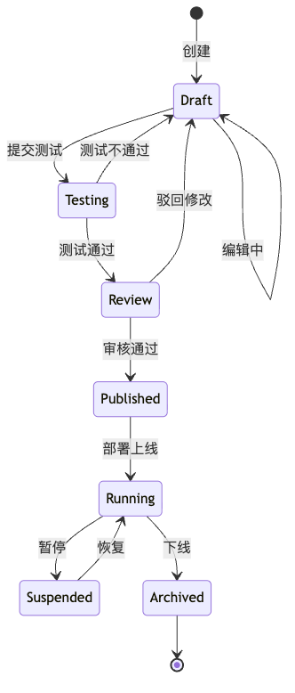

# AI Agent 平台 (aPaaS) — 多行业 AI 技术体系架构设计方案

**版本**: v1.0
**日期**: 2026-05-14
**状态**: 设计完成，待审阅

---

## 目录

1. [概述与定位](#1-概述与定位)
2. [总体架构](#2-总体架构)
3. [基础设施层](#3-基础设施层)
4. [AI 能力层](#4-ai-能力层)
5. [Agent 平台层](#5-agent-平台层)
6. [行业解决方案层](#6-行业解决方案层)
7. [平台横切能力](#7-平台横切能力)
8. [技术选型矩阵](#8-技术选型矩阵)
9. [部署架构与演进路线](#9-部署架构与演进路线)

---

## 1. 概述与定位

### 1.1 产品定位

本产品定位为**面向多行业的 AI Agent 平台型产品（aPaaS — AI Platform as a Service）**，客户可基于平台自助构建、运行、管理面向自身业务的 AI Agent 和智能应用。

定位一句话：**让每个行业的企业都能像搭建 SaaS 工作流一样搭建 AI 数字员工。**


### 1.2 目标客户画像

| 层级 | 典型客户 | 核心诉求 | 付费能力 |
|------|---------|---------|---------|
| **大型企业** | 行业龙头，年营收 10 亿+ | AI 能力私有化部署、行业 know-how 封装、安全合规 | 强，百万级/年 |
| **中型企业** | 行业腰部，年营收 1-10 亿 | 快速落地 AI 场景、开箱即用的行业 Agent 模板、降低 AI 人才门槛 | 中，10-50 万/年 |
| **ISV/伙伴** | 行业软件开发/咨询公司 | 基于平台二次开发行业方案、技能市场变现、联合交付 | 中等，按分成/授权 |

**初期切入行业**（依据团队基因选择）：
- **第一梯队**：物流/供应链（存量优势）、金融（高付费意愿 + 合规刚需）
- **第二梯队**：制造、零售、政务

### 1.3 核心价值主张

本平台填平的核心鸿沟：**"把大模型能力 → 封装成行业可用的数字员工 → 业务直接使用"**

| 价值点 | 传统方式 | 本平台方式 |
|--------|---------|-----------|
| **降门槛** | 需要 ML 工程师 + 后端 + 前端组队开发 | 业务人员可对话式构建 Agent，开发者可 Pro-Code 定制 |
| **行业化** | 通用模型+通用 Prompt，不懂行业术语和规则 | 行业知识库预置+行业连接器+行业 Agent 模板 |
| **可治理** | 黑盒调用，不知道 Agent 做了什么决策 | 全链路可观测+评估体系+合规审计 |

### 1.4 对标分析

| 维度 | 本平台 | Salesforce Agentforce | Manhattan Agent Foundry | Dify/Coze |
|------|--------|----------------------|------------------------|-----------|
| **行业深度** | ⭐⭐⭐⭐⭐ 多行业预置 | ⭐⭐⭐ CRM 行业 | ⭐⭐⭐⭐ 供应链行业 | ⭐ 通用 |
| **客户自建 Agent** | ⭐⭐⭐⭐⭐ 核心能力 | ⭐⭐⭐⭐ 自然语言+工具链 | ⭐⭐⭐⭐⭐ 三种构建路径 | ⭐⭐⭐⭐ 可视化 |
| **独立产品化** | ⭐⭐⭐⭐⭐ 独立售卖 | ❌ SF 生态绑定 | ❌ Manhattan Active 绑定 | ⭐⭐⭐ 开源/云 |
| **企业级安全** | ⭐⭐⭐⭐⭐ 私有化部署 | ⭐⭐⭐⭐ | ⭐⭐⭐⭐ | ⭐⭐ |
| **中国市场适配** | ⭐⭐⭐⭐⭐ | ⭐ | ⭐ | ⭐⭐ |
| **伙伴生态** | ⭐⭐ 起步阶段 | ⭐⭐⭐⭐⭐ AppExchange | ⭐⭐⭐ Agent Marketplace | ⭐⭐⭐ 插件市场 |

**差异化卡位**：在通用 Agent 平台（Dify/Coze）和国际垂直 Agent（Agentforce/Manhattan）之间，做一个**中国市场原生的、跨行业可复用的 AI Agent 平台层**。

---

## 2. 总体架构

### 2.1 四层融合架构全景


### 2.2 设计原则

| # | 原则 | 含义 | 架构体现 |
|---|------|------|---------|
| **P1** | **层次解耦** | 每一层有明确的接口契约，可独立演进和替换 | 层间通过标准 API/gRPC 通信，不允许跨层穿透调用 |
| **P2** | **Agent 原生** | 平台一切能力围绕 Agent 构建，"一切皆可被 Agent 调用" | 能力层全部封装为 Tool/Skill，Agent 通过统一协议调用 |
| **P3** | **行业可插拔** | 新行业接入无平台改造，通过配置+预置包完成 | 行业方案层与平台层解耦，通过 ISV SDK 和行业包机制 |
| **P4** | **企业级就绪** | 第一天就考虑多租户、安全、审计、高可用 | 横切能力层独立设计，不在业务逻辑中散落 |
| **P5** | **渐近式消费** | 客户可从任意一层进入，不必全栈采纳 | 每层提供独立 API，能力层和 Agent 层可独立售卖 |
| **P6** | **开放生态** | 不做 walled garden，拥抱标准协议 | 支持 MCP、A2A、OpenAI API 兼容协议 |

### 2.3 核心技术决策

| # | 决策点 | 选项 | 选择 | 理由 |
|---|--------|------|------|------|
| **D1** | Agent 框架 | LangGraph / CrewAI / 自研 | **自研轻量引擎 + LangGraph 内核** | 需要深度定制（多 Agent 协作、行业工作流），但复用社区的图编排能力 |
| **D2** | 模型接入模式 | 单一供应商 / 多模型网关 | **多模型网关** | 客户需要模型选择自由，且不同场景最优模型不同 |
| **D3** | 内存/状态管理 | 无状态 / 有状态 Agent | **有状态 + 分层记忆** | B2B 场景需要长对话上下文、跨会话记忆、行业知识持久化 |
| **D4** | 技能扩展机制 | 代码级插件 / 声明式配置 | **声明式 + 代码级双模** | 简单技能声明式（API 调用），复杂技能支持自定义代码 |
| **D5** | 部署模式 | 纯 SaaS / 纯私有化 / 混合 | **混合部署** | 大客户需要私有化（数据不出域），中小企业接受 SaaS |
| **D6** | 多租户隔离 | 逻辑隔离 / 物理隔离 | **逻辑隔离 + 可升级物理隔离** | 中小客户逻辑隔离降成本，大客户可选专属实例 |
| **D7** | 消息协议 | REST / gRPC / MCP / A2A | **多协议共存** | REST=外部集成, gRPC=内部服务, MCP=技能连接, A2A=Agent 间通信 |

### 2.4 请求链路全景


---

## 3. 基础设施层

### 3.1 定位与边界

基础设施层的职责：**为上层提供稳定、弹性、安全的算力与数据底座**，对上层完全透明——上层不感知 GPU 是 A100 还是 H100，不感知向量库是 Milvus 还是 Qdrant。

### 3.2 GPU 推理集群


| 能力 | 设计 | 说明 |
|------|------|------|
| **模型冷热管理** | 三级缓存调度 | Hot(常驻 GPU) → Warm(5s 加载) → Cold(按需拉取，30s) |
| **GPU 亲和性** | 同模型请求尽量路由到同一 GPU | 复用 KV Cache，延迟降低 40%+ |
| **优先级抢占** | 在线推理 > 离线评估 > 模型训练 | 保障生产 SLA，离线任务填充空闲算力 |
| **弹性伸缩** | HPA 基于队列深度 + GPU 利用率 | 最小 0（无请求零成本），最大配额内自动扩 |
| **异构支持** | NVIDIA + 国产芯片（昇腾/寒武纪） | 信创合规客户可选国产芯片池 |

### 3.3 向量数据库


| 存储类型 | 选型 | 用途 | 规模设计 |
|---------|------|------|---------|
| **主向量存储** | Milvus (分布式) | 行业知识库、Long-term Memory、技能索引 | 单租户隔离 Collection，支持十亿级 |
| **热数据缓存** | Qdrant (单节点) | 最近 7 天会话向量、高频检索缓存 | 内存映射，P99 < 5ms |
| **混合检索** | Elasticsearch | BM25 关键词 + 向量混合召回 | 与 Milvus 互补，覆盖精确匹配场景 |

**多租户隔离策略**：
```
Collection 粒度：
  SaaS 客户 → 共享 Collection + partition_key 隔离（降低成本）
  私有化客户 → 独立 Collection（物理隔离）
```

### 3.4 图数据库

| 数据类别 | 存储 | 典型查询 |
|---------|------|---------|
| 行业知识图谱 | Neo4j | "客户 A 的供应商 B 在去年 Q4 的准时率？" → 实体-关系-属性链 |
| Agent 协作拓扑 | Neo4j | 多 Agent 编排的 DAG 依赖、循环检测 |
| 权限关系图 | PostgreSQL + 递归 CTE | "此用户能访问哪些 Agent 的执行结果？" |
| 技能依赖图 | Neo4j | "更新技能 X 会影响哪些 Agent？" → 影响分析 |

### 3.5 消息中间件


**设计要点**：
- **Agent 事件溯源**：所有 Agent 状态变更写入事件流，支持重放和回溯
- **异步解耦**：Agent 执行 → 评估 → 计费 → 审计，通过事件流异步串联，不阻塞主链路
- **可靠投递**：At-least-once + 幂等消费、死信队列（DLQ）兜底

### 3.6 对象存储与关系数据库


### 3.7 安全网关


| 安全层次 | 组件 | 职责 |
|---------|------|------|
| **边缘防护** | WAF + API Gateway | 防 DDoS、IP 黑白名单、TLS 终结 |
| **身份认证** | Keycloak / Auth0 | OIDC/OAuth2.0、SAML 企业 SSO、MFA |
| **权限控制** | OpenFGA / OPA | RBAC(角色) + ABAC(属性) + ReBAC(关系) |
| **内容安全** | LLM Firewall (自研) | 输入检测(Prompt Injection / Jailbreak)、输出检测(敏感信息泄露 / 有害内容) |
| **数据安全** | 加解密服务 + KMS | 传输 TLS 1.3、存储 AES-256、密钥轮换 |

### 3.8 可观测性

**可观测性三支柱：**

**Metrics (Prometheus + Grafana)**
- 模型网关: 请求量/延迟(P50/P95/P99)/错误率/Token 消耗
- GPU 集群: GPU 利用率/显存/温度/队列深度
- Agent: 成功率/平均步数/耗时/Token 效率
- 业务: Agent 活跃数/客户使用量/SLA 达标率

**Tracing (OpenTelemetry + Jaeger)**
- Agent 执行链路: 用户请求 → Agent Router → LLM → Tool
- RAG 召回链路: Query → Embedding → Search → Rerank
- 模型调用链路: Gateway → Router → Engine → Response

**Logging (Loki + 结构化日志)**
- Agent 步骤日志 (JSON Schema 标准化)
- 模型调用日志 (Prompt + Response + Token 统计)
- 审计日志 (谁/何时/做了什么) → 合规必备
- 错误日志 (堆栈 + 上下文快照)

**Agent 专属可观测性**（区别于传统微服务）：

| 独有指标 | 说明 |
|---------|------|
| **Agent 成功率** | Agent 任务完成率（含部分成功 / 降级完成） |
| **幻觉率** | 引用来源与生成内容的一致性评分 |
| **Tool 调用准确率** | 是否在正确时机选择了正确的 Tool |
| **Token 效率** | 完成任务的实际 Token 消耗 vs 预算 |
| **用户干预率** | Agent 执行中需要人工介入的频率 |

---

## 4. AI 能力层

### 4.1 定位与边界

AI 能力层是平台的**技术中台**，给 Agent 层提供原子化的 AI 能力：模型调用、知识检索、Prompt 管理、知识图谱查询。

核心原则：**能力原子化、接口标准化、质量可度量**。每一能力模块独立部署、独立 scaling、独立计费。

### 4.2 模型网关 (Model Gateway)

#### 架构


#### 智能路由


#### Fallback 链


#### 关键设计决策

| 决策 | 选择 | 理由 |
|------|------|------|
| API 协议 | OpenAI API 兼容 (/v1/chat/completions) | 生态兼容性最强，LangChain/LlamaIndex 等框架零成本接入 |
| 模型注册 | 声明式 YAML 配置 + Admin UI | 新模型接入不需要改代码 |
| 多供应商 | 统一抽象层，每供应商一个 Adapter | 新增供应商只需实现 Adapter 接口 |
| 缓存策略 | 语义缓存 (Semantic Cache)，非精确匹配 | LLM 场景精确匹配命中率极低，语义相似匹配可提升 20-30% 缓存命中 |
| 限流策略 | Token Bucket，租户+模型双维度 | 防止单租户打爆某个模型，保障公平性 |

### 4.3 RAG 引擎

#### 检索增强生成流水线


#### 分块策略矩阵

| 文档类型 | 分块策略 | Chunk Size | Overlap | 特殊处理 |
|---------|---------|------------|---------|---------|
| 技术文档/Markdown | 按标题层级切分 | 512 tokens | 50 | 保留标题层级路径 |
| 法律合同 | 按条款切分 | 1024 tokens | 100 | 条款编号索引 |
| 表格数据 | 按行+上下文切分 | 按表格 | — | 保留表头+行号 |
| 代码 | AST 语法树切分 | 按函数/类 | 0 | 保留导入和类型定义 |
| 对话记录 | 按轮次切分 | 按轮次 | 前1轮 | 保留角色和时间戳 |

#### 行业知识库模型


### 4.4 Prompt 管理中心 (Prompt Hub)

#### 生命周期


#### Prompt 模板示例

```yaml
id: prompt-logistics-cs-v2.3
name: 物流客服系统提示词
version: 2.3.0
base: prompt-customer-service-base-v1.0
industry: logistics
variables:
  - name: company_name
    type: string
    source: tenant_config
  - name: sop_docs
    type: knowledge_base
    source: rag_retrieval
    top_k: 5
model_constraints:
  min_tokens: 512
  temperature: 0.3
evaluation:
  benchmark: logistics_cs_eval_set
  min_score: 0.85
template: |
  你是{{company_name}}的物流智能助手。
  
  处理原则：
  1. 优先从标准作业流程(SOP)中查找答案
  2. 涉及赔偿/投诉，严格按规章制度回复
  3. 无法处理的问题，引导客户联系人工客服
  
  参考知识：
  {{sop_docs}}
```

#### 评估闭环

**评估闭环流程：**

*左路 (发布前):* 新 Prompt 版本上线 → 评估集测试(回归测试) → Score ≥ 0.85? → 是: 发布 / 否: 回退

*右路 (发布后):* 线上运行 → 收集效果指标(采纳率/满意度/转人工率) → Score 下降 > 5%? → 是: 自动告警→人工介入

### 4.5 知识图谱引擎

与 RAG 的非结构化检索互补，知识图谱解决**结构化关系推理**场景：

- RAG: "仓库 SOP 中入库流程是什么？" → 段落检索 → LLM 回答
- 知识图谱: "客户 A 所有延迟超过 3 天的订单涉及哪些承运商？" → 图遍历 → 精确回答

**构建流水线：**
1. 非结构化文档 → LLM 实体抽取 → 实体对齐 → 关系抽取
2. 结构化数据 → Schema Mapping → 批量导入
3. 人工标注 → 审核校正 → 知识融合

**物流行业本体示例：**
```
(客户A) -[:下单]-> (订单001) -[:包含]-> (商品SKU-123)
(客户A) -[:分配给]-> (承运商B) -[:派遣]-> (车辆C)
(车辆C) -[:运输途中]-> (GPS轨迹{lat,lng})
(车辆C) -[:经停]-> (中转仓D) -[:入库]-> (库位E-3-15)
```

### 4.6 MLOps 流水线（Agent 导向）

传统 MLOps 是训练密集型（数据→训练→评估→部署），Agent MLOps 是**迭代密集型**（Prompt→评估→发布→监控→反馈）。


**评估维度：**
- 准确性: 答案正确率、引用准确率
- 安全性: 有害内容率、越狱成功率
- 效率: 平均步数、Token 消耗
- 体验: 用户满意度、任务完成率
- 一致性: 同 Query 多次结果一致性

### 4.7 语义缓存层

**语义缓存决策链：**

1. 请求流入 → 精确匹配缓存? → Yes: 直接返回 (~5% 命中率)
2. → No → 语义相似度计算 (Embedding Cosine Similarity)
3. Similarity > 0.95 → 返回缓存结果 + 标记 cached
4. Similarity > 0.85 → 返回缓存结果 + 追加差异补充
5. Similarity < 0.85 → 调用 LLM + 结果写入缓存

典型命中率: 20-35% (企业场景同质化问题占比高)

---

## 5. Agent 平台层

### 5.1 定位

Agent 平台层是产品的**核心引擎**：让 Agent 被构建、运行、管理和复用。

### 5.2 Agent 生命周期



| 阶段 | 触发者 | 关键行为 | 产出物 |
|------|--------|---------|--------|
| **Draft** | 构建者 | 配置 Agent 定义、选择技能、编写 Prompt | Agent 草稿 |
| **Testing** | 系统自动 | 评估集自动测试、回归测试 | 评估报告 |
| **Review** | 审核者 | 人工审核评估结果、审批发布 | 审批记录 |
| **Published** | 系统 | 版本锁定、镜像打包 | Agent 版本快照 |
| **Running** | 运维/系统 | 部署、监控、自动扩缩 | 运行实例 |

### 5.3 Agent 构建方式（三级）

| 方式 | 目标用户 | 实现 | 覆盖预期 |
|------|---------|------|---------|
| **对话式构建 (No-Code)** | 业务人员 | "帮我创建一个能回答仓库 SOP 的助手" → LLM 自动选技能、配 Prompt、建议测试 | 30% |
| **可视化编排 (Low-Code)** | 业务分析师 | 拖拽式工作流 + 预置模板定制 | 50% |
| **Pro-Code** | 开发者 | Python/JS SDK + CLI，完全控制 | 20% |

### 5.4 Agent 定义 DSL

```yaml
apiVersion: agent.platform/v1
kind: Agent
metadata:
  name: logistics-exception-handler
  version: 2.1.0
  industry: logistics
spec:
  model:
    primary: claude-opus-4-7
    fallback: deepseek-v4
    temperature: 0.3
    max_tokens: 4096
  
  prompt:
    ref: prompt-logistics-exception-v2
  
  skills:
    - ref: skill-track-query
      required: true
    - ref: skill-abnormal-detection
      required: true
    - ref: skill-customer-notify
      required: false
  
  knowledge:
    - ref: kb-logistics-sop
      retrieval_top_k: 5
  
  memory:
    short_term: { max_turns: 20, ttl: 3600 }
    long_term: { enabled: true, scope: tenant }
  
  execution:
    max_steps: 15
    timeout: 120s
    
    human_approval:
      enabled: true
      triggers:
        - action: cancel_order
        - amount_gt: 10000
        - confidence_lt: 0.8
  
  evaluation:
    dataset: eval-logistics-exception
    min_score: 0.85
```

### 5.5 编排引擎

#### 编排策略层次

| 策略 | 场景 | 示例 |
|------|------|------|
| **Simple** | 单步对话，无工具调用 | 问答 |
| **Chain** | 顺序管道，固定流程 | 入库六步流程 |
| **Router** | 条件分支，规则/LLM 判定 | 异常分级路由 |
| **Graph** | 复杂 DAG，多路并行+汇聚 | 多 Agent 协作 |

#### 多 Agent 协作模式

1. **Sequential**: [Agent A] → [Agent B] → [Agent C] (客服→路由→通知)
2. **Router**: 根据行业/意图分发到对应 Agent
3. **Hierarchical**: Supervisor Agent 分配子任务+汇总结果
4. **Mesh**: 复杂跨部门流程网状协作
5. **Debate**: 多 Agent 交叉验证 (风险评估、合规审查)

#### 协作协议

| 协议 | 用途 | 优先级 |
|------|------|--------|
| **A2A** | Agent 间任务委托和状态同步 | 优先支持 |
| **MCP** | Agent 调用外部 Tool/Skill | 优先支持 |
| **内部 gRPC** | 平台内 Agent 间高性能通信 | 自研 |
| **Webhook** | 结果推送到外部系统 | 标准 HTTP |

### 5.6 技能市场

**技能市场生态：**

| 来源 | 类型 | 示例 |
|------|------|------|
| **平台官方** | 基础技能 | 运单查询、天气查询、短信通知、邮件发送 |
| **ISV/伙伴** | 行业技能 | 报关、授信审批、质检规则、合规稽核 |
| **社区/客户** | 定制技能 | 内部 SOP、特定 API 对接 |

发布流程: 开发 → 测试 → 审核 → 上架 → 版本管理
计费模式: 免费基础 / 按调用付费 / 按月订阅

### 5.7 分层记忆系统


### 5.8 评估监控体系

**离线评估（发布前）**：
- LLM-as-Judge：准确性、有用性、安全性评分
- 规则断言：格式校验、关键字包含、JSON 有效性、引用完整性
- 人工标注：金标数据、边角案例、对抗样本

**在线监控（发布后）**：
- 实时指标：采纳率、转人工率、平均耗时、Token 效率
- 异常检测：指标突降、幻觉率飙升、P99 延迟恶化
- 反馈回路：👍👎 评分、用户评论、纠错数据

---

## 6. 行业解决方案层

### 6.1 行业包 (Industry Pack) 模型

行业包 = 行业平台的最小交付单元，包含：

**Industry Pack: logistics-v3.2 包含：**
- 预置 Agent 模板: 异常处理、路径优化、仓储问答、客户服务
- 行业知识库: 物流 SOP、报关规则、运价表、承运商 DB
- 行业技能: 运单查询、时效预测、异常检测、路线推荐
- 行业连接器: TMS/WMS/OMS 对接
- Prompt 模板: 物流场景专用 Prompt
- 评估集: 物流评测专用用例
- 行业数据模型 (Ontology): 实体/关系/术语体系

### 6.2 行业接入流程

| 阶段 | 周期 | 任务 |
|------|------|------|
| **Phase 1: 行业调研** | 2-4 周 | Know-how 梳理、竞品对标、本体构建、Top 10 场景识别 |
| **Phase 2: 行业包构建** | 4-8 周 | 知识库构建、Agent 模板开发、技能开发、连接器开发、评估集构建 |
| **Phase 3: 伙伴联合验证** | 4-6 周 | 1-2 家灯塔客户联合打磨、真实场景测试调优、案例产出 |
| **Phase 4: 正式发布** | — | 上架技能市场、Landing Page/Demo、联合推广、运营反馈 |

### 6.3 首批行业 Agent 矩阵

**物流行业**：

| 领域 | Agent | 核心能力 |
|------|-------|---------|
| 运输管理 | 路径优化 Agent | 实时路况+费率、多目标优化、承运商推荐 |
| 运输管理 | 异常处理 Agent | 延迟自动检测、根因分析、升级策略、客户通知 |
| 仓储管理 | 库存巡检 Agent | 库存健康检查、补货建议、效期预警 |
| 仓储管理 | 波次协调 Agent | 波次前检查、问题预警、修复方案 |
| 客户服务 | 智能客服 Agent | 运单查询、异常处理引导、索赔引导 |
| 伙伴结算 | 对账结算 Agent | 运费自动核算、异常差异识别、付款建议 |
| 伙伴结算 | 合规审查 Agent | 报关合规检查、证件有效期、法规变更预警 |

**金融行业**：

| Agent | 核心能力 |
|-------|---------|
| 合规审查 Agent | 监管条例检索、材料合规检查、审查报告生成 |
| 风控评估 Agent | 企业风险画像、异常交易检测、风险评级建议 |
| 智能客服 Agent | 产品咨询、业务办理引导、合规话术 |
| 报告生成 Agent | 尽调报告、授信报告、监管报送 |

### 6.4 多租户隔离

| Tier | 模式 | 隔离度 | 成本 | 适用 |
|------|------|--------|------|------|
| **Tier 1** | 共享 SaaS (Schema 级隔离) | 逻辑隔离 | 低 | <500 用户 |
| **Tier 2** | 专属实例 (K8s Namespace + 独立 DB) | 资源隔离 | 中 | 500-5000 用户 |
| **Tier 3** | 私有化部署 (完全物理隔离) | 物理隔离 | 高 | 无上限 |

### 6.5 连接器生态

| 层级 | 内容 |
|------|------|
| **Layer 1: 行业标准连接器** | 物流(TMS/WMS/OMS)、金融(核心银行/征信/反洗钱)、制造(ERP/MES/SCADA) |
| **Layer 2: 通用连接器** | 数据库(MySQL/PG/Oracle)、文件(SFTP/S3)、消息(Kafka/RabbitMQ)、协作(飞书/钉钉/企微) |
| **Layer 3: 自定义连接器** | 通过 Connector SDK 自行开发，可上架技能市场 |

---

## 7. 平台横切能力

### 7.1 安全合规体系（五层）

| 层次 | 能力 |
|------|------|
| **Layer 1: 基础设施安全** | 镜像扫描、漏洞管理、配置基线、入侵检测 |
| **Layer 2: 网络安全** | WAF、DDoS 防护、IP 黑白名单、VPC 隔离 |
| **Layer 3: 应用安全** | OAuth 2.0/OIDC、RBAC/ABAC、API 限流、SSO、MFA |
| **Layer 4: AI 安全** | Prompt Injection 检测、Jailbreak 防御、有害内容过滤、幻觉检测、Agent 行为边界约束 |
| **Layer 5: 数据安全** | TLS 1.3、AES-256、KMS、PII 脱敏、数据分类分级、数据出境管控 |

### 7.2 计费模型

**基础平台费 (订阅制):** Free → Pro → Business → Enterprise

**用量计费 (Pay-as-you-go):**
- Token 消耗 (按模型差异化定价)
- 知识库存储 (GB/月)
- Agent 调用次数
- 技能市场消费

**增值服务:**
- 行业包订阅
- 专属 GPU 实例
- 私有化部署 license
- SLA 升级

### 7.3 开发者体验

| 工具 | 说明 |
|------|------|
| **SDK** | Python / JS/TS / Java |
| **CLI** | `$ ai agent deploy`、`$ ai skill create` |
| **VS Code 插件** | 一键创建、本地调试 |
| **Agent Playground** | 在线调试沙箱：对话面板 + 调试面板 (Trace/步骤状态/耗时) + 配置面板 + 评估面板 |
| **API Docs** | OpenAPI 规范 + 交互式文档 |

---

## 8. 技术选型矩阵

### 8.1 核心技术栈

| 层级 | 组件 | 选型 | 选型理由 |
|------|------|------|---------|
| **容器编排** | K8s | K8s | 行业标准，混合部署必备 |
| **GPU 推理** | 推理引擎 | vLLM + TGI | vLLM 吞吐最高，TGI 生态兼容好 |
| **向量数据库** | 主存储 | Milvus | 分布式能力强，十亿级规模验证 |
| | 热缓存 | Qdrant | 内存映射，P99 < 5ms |
| **图数据库** | 知识图谱 | Neo4j | 生态最成熟，Cypher 查询最普及 |
| **消息队列** | 事件总线 | Kafka | 生态最广 |
| **缓存** | 分布式 | Redis Cluster | 生态+性能+持久化 |
| **关系数据库** | 业务数据 | PostgreSQL | JSON 支持好，PGVector 复用 |
| **对象存储** | 文件/日志 | MinIO | S3 兼容，私有化部署友好 |
| **模型网关** | LLM 接入 | 自研 LiteLLM 内核 | 轻量级，定制灵活，无框架绑定 |
| **Agent 框架** | 编排引擎 | LangGraph + 自研 | 社区活跃，图编排成熟 |
| **RAG 引擎** | 检索增强 | LlamaIndex + 自研 | 检索管道灵活，可定制性强 |
| **可观测性** | Metrics | Prometheus + Grafana | 标准选型 |
| | Tracing | OpenTelemetry + Jaeger | CNCF 标准 |
| | Logging | Loki + Promtail | 与 Prometheus 统一栈 |
| **安全** | 身份认证 | Keycloak | 开源，支持私有化部署 |
| | 权限 | OpenFGA | ReBAC 支持好，适合 Agent 权限场景 |
| **API 网关** | 流量入口 | APISIX | 性能好，插件丰富 |
| **CI/CD** | 持续交付 | ArgoCD + GitHub Actions | GitOps 模式 |

### 8.2 关键决策

**D1: Agent 编排 — LangGraph + 自研策略层**：LangGraph 提供图编排+Checkpoint 内核能力，在此基础上自研 Simple/Chain/Router/Graph/Debate 策略层。

**D2: 不选 Dify/Coze 作为底座**：行业深度不够、企业级能力欠缺、定制能力有限、生态锁定、商业风险。

**D3: 国产化适配策略**：所有外部依赖通过 Adapter 模式接入，国产替代 = 实现新 Adapter，不改核心逻辑。三级适配：基础设施(国产 GPU/OS/芯片) → 中间件(达梦/OceanBase/RocketMQ) → 模型(通义/文心/智谱/DeepSeek)。

---

## 9. 部署架构与演进路线

### 9.1 SaaS 部署拓扑


**私有化部署最小拓扑**：K8s 3-Node Cluster，最低 64 vCPU + 256GB RAM + 1×A100 GPU (或 2×T4)。

### 9.2 分期路线图

```
Phase 1: MVP (0-6月)
  目标: 1 个行业跑通 3 个 Agent 场景
  交付: 模型网关 + 基础RAG + Agent运行时(Simple/Chain) + Prompt管理 + 物流行业3Agent模板
  团队: 后端4 + AI3 + 前端2 + DevOps1

Phase 2: 平台化 (6-12月)
  目标: Agent 平台完备，3 个行业可用
  交付: 全生命周期 + Router/Graph编排 + 技能市场 + 分层记忆 + 评估体系 + 多租户计费 + 私有化
  团队: 后端8 + AI6 + 前端4 + DevOps2

Phase 3: 生态化 (12-24月)
  目标: 平台生态成形，伙伴可自建行业方案
  交付: 多Agent协作(Hierarchical/Debate) + 知识图谱 + ISV伙伴平台 + 6+行业方案 + 信创适配 + 多活
  团队: 后端12 + AI10 + 前端6 + DevOps3

Phase 4: 智能化 (24-36月)
  目标: AI 自主驱动平台运营，Agent 自我进化
  交付: Agent自动优化 + 跨Agent学习 + 行业知识自动发现 + Agent间市场 + 全球化部署
```

### 9.3 组织架构

**组织架构：**
- **AI 平台负责人**
  - **平台工程组**: 基础设施/网关/安全/多租户/开发者工具
  - **AI 算法组**: Agent 引擎/模型网关/RAG/知识图谱/评估
  - **行业方案组**: 物流/金融/制造/伙伴赋能/解决方案架构
  - **产品 & 设计**: PM×2 + UX×2 + Tech Writer×1

### 9.4 关键风险与缓解

| 风险 | 影响 | 概率 | 缓解措施 |
|------|------|------|---------|
| **模型能力瓶颈** | 高 | 中 | 多模型网关+Falback，不绑定单一供应商 |
| **客户 AI 认知不足** | 高 | 高 | Phase 1 聚焦灯塔客户，联合打磨标杆案例 |
| **数据安全合规** | 高 | 中 | 安全体系 Day 1 构建；私有化 Phase 2 上线 |
| **竞品快速跟进** | 中 | 高 | 行业 know-how 壁垒（连接器+知识库+本体）+ ISV 生态绑定 |
| **GPU 供应链风险** | 中 | 低 | 国产芯片支持；多云混合调度 |
| **Agent 不可控行为** | 高 | 中 | 多级安全护栏；Human-in-the-loop；灰度发布 |

---

## 10. 从零搭建路线图

### 10.1 搭建总览

```

```

### 10.2 Phase 1：基础设施层搭建（Week 1-2）

#### 10.2.1 K8s 集群准备

```bash
# 方案 A: 自建 K8s (推荐生产环境)
# 3 Master + 5 Worker, Calico CNI, MetalLB

# 方案 B: 开发/测试环境快速搭建
kind create cluster --name ai-platform --config - <<EOF
kind: Cluster
apiVersion: kind.x-k8s.io/v1alpha4
nodes:
- role: control-plane
- role: worker
- role: worker
- role: worker
EOF

# 验证集群就绪
kubectl get nodes
kubectl create namespace ai-platform
```

#### 10.2.2 GPU Operator 部署

```bash
# NVIDIA GPU Operator
helm repo add nvidia https://helm.ngc.nvidia.com/nvidia
helm install gpu-operator nvidia/gpu-operator \
  --namespace gpu-operator --create-namespace \
  --set driver.enabled=true \
  --set toolkit.enabled=true

# 验证 GPU 可用
kubectl describe nodes | grep nvidia.com/gpu

# 创建 GPU 节点池标签
kubectl label node gpu-node-1 accelerator=nvidia-a100
kubectl label node gpu-node-2 accelerator=nvidia-h100
```

#### 10.2.3 基础设施组件部署

```bash
# 1. PostgreSQL (业务数据)
helm install postgresql bitnami/postgresql \
  --namespace ai-platform \
  --set auth.database=ai_platform \
  --set primary.persistence.size=200Gi

# 2. Redis Cluster (缓存/会话/限流)
helm install redis bitnami/redis-cluster \
  --namespace ai-platform \
  --set replicaCount=3

# 3. Milvus (向量数据库)
helm install milvus milvus/milvus \
  --namespace ai-platform \
  --set standalone.resources.limits.memory=32Gi

# 4. Neo4j (图数据库)
helm install neo4j neo4j/neo4j \
  --namespace ai-platform

# 5. Kafka (消息队列)
helm install kafka bitnami/kafka \
  --namespace ai-platform \
  --set replicaCount=3

# 6. MinIO (对象存储)
helm install minio bitnami/minio \
  --namespace ai-platform \
  --set mode=distributed \
  --set persistence.size=500Gi

# 7. Prometheus + Grafana (可观测性)
helm install kube-prometheus prometheus-community/kube-prometheus-stack \
  --namespace monitoring --create-namespace
```

#### 10.2.4 基础设施验证检查清单

| # | 检查项 | 验证命令 | 预期结果 |
|---|--------|---------|---------|
| 1 | K8s 集群节点就绪 | `kubectl get nodes` | 全部 Ready |
| 2 | GPU 可调度 | `kubectl describe nodes \| grep nvidia.com/gpu` | >=1 GPU |
| 3 | PostgreSQL 连接 | `kubectl exec -it deploy/postgresql -- psql -U postgres` | 进入 psql |
| 4 | Redis 读写 | `kubectl exec -it deploy/redis -- redis-cli PING` | PONG |
| 5 | Milvus 健康 | `curl http://milvus:9091/healthz` | 200 OK |
| 6 | Neo4j 可访问 | `curl http://neo4j:7474` | 200 OK |
| 7 | Kafka Topic 创建 | `kafka-topics.sh --create --topic test` | Created |
| 8 | MinIO Bucket | `mc mb ai-platform/test` | Bucket created |
| 9 | Prometheus Target | 访问 Grafana → Targets | All UP |
| 10 | 日志采集 | 查询 Loki | 有日志流入 |

### 10.3 Phase 2：AI 能力层部署（Week 3-4）

#### 10.3.1 模型推理引擎部署

```bash
# vLLM 部署 (高吞吐推理)
kubectl apply -f - <<EOF
apiVersion: apps/v1
kind: Deployment
metadata:
  name: vllm-server
  namespace: ai-platform
spec:
  replicas: 2
  selector:
    matchLabels:
      app: vllm-server
  template:
    metadata:
      labels:
        app: vllm-server
    spec:
      nodeSelector:
        accelerator: nvidia-a100
      containers:
      - name: vllm
        image: vllm/vllm-openai:latest
        args:
        - --model
        - deepseek-ai/DeepSeek-V3
        - --gpu-memory-utilization
        - "0.9"
        - --max-model-len
        - "32768"
        ports:
        - containerPort: 8000
        resources:
          limits:
            nvidia.com/gpu: 4
EOF
```

#### 10.3.2 模型网关部署

```yaml
# model-gateway-config.yaml
apiVersion: v1
kind: ConfigMap
metadata:
  name: model-gateway-config
  namespace: ai-platform
data:
  models.yaml: |
    providers:
      - name: openai
        models: [gpt-4o, gpt-4o-mini]
        endpoint: https://api.openai.com/v1
        api_key_env: OPENAI_API_KEY
      
      - name: anthropic
        models: [claude-opus-4-7, claude-sonnet-4-6]
        endpoint: https://api.anthropic.com/v1
        api_key_env: ANTHROPIC_API_KEY
      
      - name: vllm-self-hosted
        models: [deepseek-v3]
        endpoint: http://vllm-server.ai-platform:8000/v1
      
      - name: tongyi
        models: [qwen-max, qwen-plus]
        endpoint: https://dashscope.aliyuncs.com/compatible-mode/v1
        api_key_env: DASHSCOPE_API_KEY
    
    routing:
      default: anthropic/claude-sonnet-4-6
      rules:
        - pattern: "简单对话|FAQ|基础查询"
          target: vllm-self-hosted/deepseek-v3
        - pattern: "复杂推理|代码生成|合规审查"
          target: anthropic/claude-opus-4-7
        - pattern: "合规|数据敏感|私有数据"
          target: vllm-self-hosted/deepseek-v3
        - pattern: "嵌入|embedding"
          target: vllm-self-hosted/deepseek-v3
    
    fallback:
      anthropic/claude-opus-4-7:
        - anthropic/claude-sonnet-4-6
        - openai/gpt-4o
        - vllm-self-hosted/deepseek-v3
      vllm-self-hosted/deepseek-v3:
        - tongyi/qwen-plus
        - openai/gpt-4o-mini
```

#### 10.3.3 RAG 引擎部署

```bash
# 1. Embedding Service
kubectl apply -f - <<EOF
apiVersion: apps/v1
kind: Deployment
metadata:
  name: embedding-service
  namespace: ai-platform
spec:
  replicas: 3
  selector:
    matchLabels:
      app: embedding-service
  template:
    metadata:
      labels:
        app: embedding-service
    spec:
      containers:
      - name: embedding
        image: ai-platform/embedding-service:latest
        ports:
        - containerPort: 8080
        env:
        - name: MODEL_NAME
          value: BAAI/bge-large-zh-v1.5
        - name: MILVUS_HOST
          value: milvus.ai-platform
        resources:
          limits:
            nvidia.com/gpu: 1
EOF

# 2. 文档处理管道
kubectl apply -f - <<EOF
apiVersion: apps/v1
kind: Deployment
metadata:
  name: doc-processor
  namespace: ai-platform
spec:
  replicas: 2
  selector:
    matchLabels:
      app: doc-processor
  template:
    metadata:
      labels:
        app: doc-processor
    spec:
      containers:
      - name: doc-processor
        image: ai-platform/doc-processor:latest
        ports:
        - containerPort: 8081
        env:
        - name: EMBEDDING_SERVICE
          value: http://embedding-service.ai-platform:8080
        - name: CHUNK_SIZE
          value: "512"
        - name: CHUNK_OVERLAP
          value: "50"
EOF

# 3. 检索服务
kubectl apply -f - <<EOF
apiVersion: apps/v1
kind: Deployment
metadata:
  name: retriever-service
  namespace: ai-platform
spec:
  replicas: 3
  selector:
    matchLabels:
      app: retriever-service
  template:
    metadata:
      labels:
        app: retriever-service
    spec:
      containers:
      - name: retriever
        image: ai-platform/retriever:latest
        ports:
        - containerPort: 8082
        env:
        - name: MILVUS_HOST
          value: milvus.ai-platform
        - name: ES_HOST
          value: http://elasticsearch.ai-platform:9200
        - name: NEO4J_URI
          value: bolt://neo4j.ai-platform:7687
        - name: EMBEDDING_SERVICE
          value: http://embedding-service.ai-platform:8080
EOF
```

#### 10.3.4 Prompt Hub 部署

```bash
kubectl apply -f - <<EOF
apiVersion: apps/v1
kind: Deployment
metadata:
  name: prompt-hub
  namespace: ai-platform
spec:
  replicas: 2
  selector:
    matchLabels:
      app: prompt-hub
  template:
    metadata:
      labels:
        app: prompt-hub
    spec:
      containers:
      - name: prompt-hub
        image: ai-platform/prompt-hub:latest
        ports:
        - containerPort: 8083
        env:
        - name: DB_HOST
          value: postgresql.ai-platform
        - name: DB_NAME
          value: ai_platform
EOF
```

#### 10.3.5 AI 能力层验证检查清单

| # | 检查项 | 验证方法 | 预期 |
|---|--------|---------|------|
| 1 | vLLM 推理可用 | `curl http://vllm-server:8000/v1/models` | 返回模型列表 |
| 2 | 模型网关路由 | 发送不同意图请求 | 路由到不同模型 |
| 3 | 模型网关 Fallback | 模拟主模型超时 | 自动切换到备选 |
| 4 | Embedding 服务 | `curl -X POST /embed -d '{"text":"测试"}'` | 返回 1024 维向量 |
| 5 | 文档处理管道 | 上传测试 PDF | 成功分块+入库 |
| 6 | 检索召回 | 发送 Query | 返回 Top-K 结果 |
| 7 | Prompt Hub | 创建/发布/回滚 Prompt | 版本正常切换 |

### 10.4 Phase 3：Agent 平台层部署（Week 5-8）

#### 10.4.1 Agent 运行时部署

```yaml
# agent-runtime-deployment.yaml
apiVersion: apps/v1
kind: Deployment
metadata:
  name: agent-runtime
  namespace: ai-platform
spec:
  replicas: 3
  selector:
    matchLabels:
      app: agent-runtime
  template:
    spec:
      containers:
      - name: agent-runtime
        image: ai-platform/agent-runtime:v1.0
        ports:
        - containerPort: 8080
        env:
        - name: MODEL_GATEWAY_URL
          value: http://model-gateway.ai-platform/v1
        - name: RETRIEVER_URL
          value: http://retriever-service.ai-platform:8082
        - name: PROMPT_HUB_URL
          value: http://prompt-hub.ai-platform:8083
        - name: MEMORY_REDIS_URL
          value: redis://redis.ai-platform:6379
        - name: MEMORY_MILVUS_HOST
          value: milvus.ai-platform
        - name: SKILL_REGISTRY_URL
          value: http://skill-registry.ai-platform:8084
        - name: EVENTS_KAFKA_BROKERS
          value: kafka.ai-platform:9092
```

#### 10.4.2 Agent 编排引擎核心代码骨架

```python
# agent-runtime/orchestrator.py
from langgraph.graph import StateGraph, END
from langgraph.checkpoint.sqlite import SqliteSaver
from typing import TypedDict, List, Annotated
import operator

class AgentState(TypedDict):
    messages: Annotated[List[str], operator.add]
    current_step: int
    max_steps: int
    skill_calls: List[dict]
    memory_context: str
    knowledge_context: str
    human_approval_required: bool

class Orchestrator:
    """Agent 编排引擎 — 在 LangGraph 之上自研策略层"""
    
    def __init__(self, agent_config: dict):
        self.config = agent_config
        self.max_steps = agent_config.get("max_steps", 15)
        self.checkpointer = SqliteSaver.from_conn_string("checkpoints.db")
        
    def build_graph(self) -> StateGraph:
        workflow = StateGraph(AgentState)
        
        # 节点
        workflow.add_node("understand", self.understand_intent)
        workflow.add_node("retrieve", self.retrieve_knowledge)
        workflow.add_node("recall", self.recall_memory)
        workflow.add_node("reason", self.llm_reason)
        workflow.add_node("execute_skill", self.execute_skill)
        workflow.add_node("human_approval", self.human_approval)
        workflow.add_node("respond", self.generate_response)
        
        # 边 (编排策略)
        workflow.set_entry_point("understand")
        workflow.add_edge("understand", "retrieve")
        workflow.add_edge("retrieve", "recall")
        workflow.add_edge("recall", "reason")
        
        # 条件边 — Router 策略
        workflow.add_conditional_edges(
            "reason",
            self.decide_next_action,
            {
                "call_skill": "execute_skill",
                "need_approval": "human_approval",
                "respond": "respond",
                "max_steps": END
            }
        )
        workflow.add_edge("execute_skill", "reason")  # 循环回 reason
        workflow.add_edge("human_approval", "respond")
        workflow.add_edge("respond", END)
        
        return workflow.compile(checkpointer=self.checkpointer)
    
    def decide_next_action(self, state: AgentState) -> str:
        if state["current_step"] >= self.max_steps:
            return "max_steps"
        last_message = state["messages"][-1] if state["messages"] else ""
        if "TOOL_CALL:" in last_message:
            return "call_skill"
        if state.get("human_approval_required"):
            return "need_approval"
        return "respond"
    
    async def understand_intent(self, state: AgentState) -> AgentState:
        """Step 1: 意图理解 — 分类 + 提取槽位"""
        ...
    
    async def retrieve_knowledge(self, state: AgentState) -> AgentState:
        """Step 2: 知识检索 — 多路召回 + 融合排序"""
        ...
    
    async def recall_memory(self, state: AgentState) -> AgentState:
        """Step 3: 记忆回忆 — 短期+长期记忆"""
        ...
    
    async def llm_reason(self, state: AgentState) -> AgentState:
        """Step 4: LLM 推理 — 组装 Context → 调用模型网关 → 解析输出"""
        ...
    
    async def execute_skill(self, state: AgentState) -> AgentState:
        """Step 5: 技能执行 — 从 Skill Registry 获取技能并调用"""
        ...
    
    async def human_approval(self, state: AgentState) -> AgentState:
        """Step 6: 人工审批 — 高风险操作触发"""
        ...
    
    async def generate_response(self, state: AgentState) -> AgentState:
        """Step 7: 生成最终回复"""
        ...
```

#### 10.4.3 技能注册中心

```bash
kubectl apply -f - <<EOF
apiVersion: apps/v1
kind: Deployment
metadata:
  name: skill-registry
  namespace: ai-platform
spec:
  replicas: 2
  selector:
    matchLabels:
      app: skill-registry
  template:
    spec:
      containers:
      - name: skill-registry
        image: ai-platform/skill-registry:latest
        ports:
        - containerPort: 8084
        env:
        - name: DB_HOST
          value: postgresql.ai-platform
EOF

# 注册基础技能
curl -X POST http://skill-registry.ai-platform:8084/skills \
  -H "Content-Type: application/yaml" \
  -d '
name: track-query
version: 1.0.0
type: mcp_server
endpoint: mcp://tracking-service/query
description: 运单实时状态查询
parameters:
  - name: tracking_number
    type: string
    required: true
'
```

#### 10.4.4 评估服务部署

```bash
kubectl apply -f - <<EOF
apiVersion: apps/v1
kind: Deployment
metadata:
  name: eval-service
  namespace: ai-platform
spec:
  replicas: 2
  selector:
    matchLabels:
      app: eval-service
  template:
    spec:
      containers:
      - name: eval-service
        image: ai-platform/eval-service:latest
        ports:
        - containerPort: 8085
        env:
        - name: MODEL_GATEWAY_URL
          value: http://model-gateway.ai-platform/v1
        - name: DB_HOST
          value: postgresql.ai-platform
EOF

# 创建首个评估集
curl -X POST http://eval-service.ai-platform:8085/datasets \
  -H "Content-Type: application/json" \
  -d '{
    "name": "logistics-exception-cases",
    "version": 1,
    "industry": "logistics",
    "cases": [{
      "input": {"query": "运单 SF1234567890 延迟了，什么时候到？"},
      "expected": {
        "must_include": ["预计", "延迟原因", "SF1234567890"],
        "must_not_include": ["赔钱", "投诉电话"],
        "action": "track_query"
      }
    }]
  }'
```

#### 10.4.5 Agent 平台层验证检查清单

| # | 检查项 | 验证方法 | 预期 |
|---|--------|---------|------|
| 1 | Agent 运行时健康 | `curl http://agent-runtime:8080/healthz` | 200 |
| 2 | 编排引擎编译 | 创建简单 QA Agent → 运行 | 多步执行无错误 |
| 3 | Checkpoint 断点续执 | 模拟中断 → 重新运行 | 从断点恢复 |
| 4 | 技能注册/调用 | Agent 调用注册技能 | 返回正确结果 |
| 5 | 分层记忆 | 多轮对话 → 检查上下文 | 记忆正确使用 |
| 6 | 评估集运行 | 提交评估集 → 执行 | 返回 Score 报告 |

### 10.5 Phase 4：行业方案接入（Week 9-10）

#### 10.5.1 物流行业包部署

```bash
# 1. 注册物流行业技能
curl -X POST http://skill-registry.ai-platform:8084/skills/batch \
  -H "Content-Type: application/json" \
  -d '[
    {"name":"track-query","version":"1.0.0","type":"mcp_server","endpoint":"mcp://tracking/query","industry":"logistics"},
    {"name":"abnormal-detection","version":"1.0.0","type":"api","endpoint":"http://logistics-api/abnormal/detect","industry":"logistics"},
    {"name":"route-recommend","version":"1.0.0","type":"api","endpoint":"http://logistics-api/route/recommend","industry":"logistics"},
    {"name":"customer-notify","version":"1.0.0","type":"api","endpoint":"http://notify-service/send","industry":"logistics"},
    {"name":"carrier-sla-lookup","version":"1.0.0","type":"api","endpoint":"http://logistics-api/carrier/sla","industry":"logistics"},
    {"name":"weather-query","version":"1.0.0","type":"api","endpoint":"http://weather-api/query","industry":"common"}
  ]'

# 2. 导入物流知识库
curl -X POST http://doc-processor.ai-platform:8081/import \
  -H "Content-Type: application/json" \
  -d '{
    "tenant_id": "logistics-demo",
    "industry": "logistics",
    "files": [
      "s3://ai-platform/knowledge/logistics/sop-transport.md",
      "s3://ai-platform/knowledge/logistics/carrier-contracts.pdf",
      "s3://ai-platform/knowledge/logistics/claims-policy.md"
    ],
    "chunk_strategy": {
      "sop-transport.md": "heading",
      "carrier-contracts.pdf": "clause",
      "claims-policy.md": "heading"
    }
  }'

# 3. 注册物流 Prompt 模板
curl -X POST http://prompt-hub.ai-platform:8083/prompts \
  -H "Content-Type: application/yaml" \
  -d '
id: prompt-logistics-exception-v1
name: 物流异常处理系统提示词
version: 1.0.0
industry: logistics
variables:
  - name: company_name
    source: tenant_config
  - name: sop_context
    source: rag_retrieval
    top_k: 5
model_constraints:
  temperature: 0.3
  max_tokens: 2560
template: |
  你是{{company_name}}的物流异常处理智能助手。
  
  职责:
  1. 识别运输异常类型 (延迟/破损/丢件/地址错误/海关滞留)
  2. 根据 SOP 分级处理: P1(严重)→人工升级, P2(中等)→推荐方案, P3(轻微)→自动处理
  3. 查询承运商 SLA 和合同条款进行责任判定
  4. 涉及赔偿金额>5000元或取消订单时必须人工审批
  
  参考知识(来自SOP/合同):
  {{sop_context}}
  
  处理原则:
  1. 先定位问题根因,再推荐方案
  2. 优先保障客户体验,同时控制成本
  3. 无法100%确定时,标记confidence并建议人工介入
'

# 4. 创建物流异常处理 Agent
curl -X POST http://agent-runtime.ai-platform:8080/agents \
  -H "Content-Type: application/yaml" \
  -d '
apiVersion: agent.platform/v1
kind: Agent
metadata:
  name: logistics-exception-handler
  version: 1.0.0
  industry: logistics
spec:
  model:
    primary: claude-sonnet-4-6
    fallback: deepseek-v3
    temperature: 0.3
    max_tokens: 2560
  prompt:
    ref: prompt-logistics-exception-v1
  skills:
    - ref: track-query
      required: true
    - ref: abnormal-detection
      required: true
    - ref: route-recommend
      required: false
    - ref: customer-notify
      required: false
    - ref: carrier-sla-lookup
      required: false
    - ref: weather-query
      required: false
  knowledge:
    - ref: kb-logistics-sop
      retrieval_top_k: 5
    - ref: kb-carrier-contracts
      retrieval_top_k: 3
  execution:
    max_steps: 10
    timeout: 60s
    human_approval:
      triggers:
        - action: cancel_order
        - amount_gt: 5000
        - confidence_lt: 0.8
  evaluation:
    dataset: logistics-exception-cases
    min_score: 0.85
'
```

#### 10.5.2 行业方案验证检查清单

| # | 检查项 | 验证方法 | 预期 |
|---|--------|---------|------|
| 1 | 物流技能全部注册 | `curl http://skill-registry:8084/skills?industry=logistics` | >=6 个 |
| 2 | 知识库入库 | 查询 Milvus | 有数据 |
| 3 | Prompt 版本可查 | `curl http://prompt-hub:8083/prompts/logistics-exception-v1` | 返回完整定义 |
| 4 | Agent 创建成功 | `curl http://agent-runtime:8080/agents/logistics-exception-handler` | 状态=active |
| 5 | Agent 端到端调用 | 发送测试异常 Query | 多步执行返回结果 |

### 10.6 Phase 5：上线验证（Week 11-12）

#### 10.6.1 端到端集成测试

```python
# test_e2e.py
import pytest
import requests

AGENT_URL = "http://agent-runtime.ai-platform:8080"

@pytest.mark.e2e
class TestLogisticsAgent:
    
    def test_delay_exception_handling(self):
        """延迟异常处理"""
        response = requests.post(f"{AGENT_URL}/agents/logistics-exception-handler/run", json={
            "query": "运单 SF1234567890，原定今天18:00到，但现在是20:00还没到，帮我处理"
        })
        data = response.json()
        assert data["status"] == "completed"
        assert data["steps_count"] >= 3
        assert "track-query" in str(data["skill_calls"])
    
    def test_damage_exception_human_approval(self):
        """破损异常触发人工审批"""
        response = requests.post(f"{AGENT_URL}/agents/logistics-exception-handler/run", json={
            "query": "货物破损严重价值8000元，申请取消订单并退款"
        })
        data = response.json()
        assert any(c["skill"] == "human_approval" for c in data["skill_calls"])
    
    def test_normal_query(self):
        """普通运单查询不触发异常"""
        response = requests.post(f"{AGENT_URL}/agents/logistics-exception-handler/run", json={
            "query": "帮我查一下运单 SF9876543210 到哪了"
        })
        assert "abnormal-detection" not in str(response.json()["skill_calls"])
    
    def test_multi_turn_memory(self):
        """多轮对话记忆"""
        session_id = requests.post(f"{AGENT_URL}/sessions").json()["session_id"]
        r1 = requests.post(f"{AGENT_URL}/agents/logistics-exception-handler/run", json={
            "session_id": session_id,
            "query": "运单 SF1234567890 延迟了"
        })
        r2 = requests.post(f"{AGENT_URL}/agents/logistics-exception-handler/run", json={
            "session_id": session_id,
            "query": "那帮我通知一下客户吧"
        })
        assert "SF1234567890" in str(r2.json()["memory_context"])
```

#### 10.6.2 性能压测

```bash
# k6 压测脚本
cat <<EOF > load-test.js
import http from 'k6/http';
import { check } from 'k6';

export const options = {
  stages: [
    { duration: '1m', target: 10 },
    { duration: '3m', target: 50 },
    { duration: '5m', target: 100 },
    { duration: '1m', target: 0 },
  ],
  thresholds: {
    'http_req_duration': ['p95<5000'],
    'http_req_failed': ['rate<0.01'],
  },
};

export default function () {
  const payload = JSON.stringify({
    query: '运单 SF' + Math.random().toString(36).substring(7) + ' 延迟了怎么办？'
  });
  const res = http.post(
    'http://agent-runtime.ai-platform:8080/agents/logistics-exception-handler/run',
    payload,
    { headers: { 'Content-Type': 'application/json' } }
  );
  check(res, {
    'status is 200': (r) => r.status === 200,
    'response time < 10s': (r) => r.timings.duration < 10000,
  });
}
EOF

k6 run load-test.js
```

#### 10.6.3 上线验证检查清单

| # | 检查项 | 通过标准 |
|---|--------|---------|
| 1 | E2E 测试全通过 | 4/4 用例通过 |
| 2 | 评估集 Score | >= 0.85 |
| 3 | P95 延迟 | < 5s |
| 4 | 错误率 | < 1% |
| 5 | Skill 调用准确率 | >= 90% |
| 6 | 语义缓存命中率 | >= 20% |
| 7 | Human-in-the-loop 误触发率 | < 5% |
| 8 | 灰度发布 | 10%→50%→100% 无回滚 |

---

## 11. 物流运输异常处理 Agent — 完整案例

### 11.1 业务场景定义

#### 11.1.1 场景选型

选择**运输异常处理**作为案例，因为它是物流行业最高频、最复杂、涉及系统最多的场景：

```
日均异常处理量 (中型物流企业): 总运单 50,000 单/天 — 正常 47,500 (95%) / 异常 2,500 (5%)。其中延迟 1,200 (48%), 破损 500 (20%), 丢件 300 (12%), 地址错误 250 (10%), 海关滞留 250 (10%)。
```

#### 11.1.2 业务 SOP—人工处理 vs Agent 自动化目标

```
当前人工处理流程 (平均 15 分钟/单):
  客服接到投诉 → 查询运单(TMS,2min) → 判断异常类型(1min)
  → 查询承运商SLA(3min) → 判定责任方(3min) → 制定方案(3min)
  → 联系客户/承运商(3min)

目标: Agent 自动化 → 平均 2 分钟/单, 覆盖 70% 异常单
```

### 11.2 Agent 完整设计

#### 11.2.1 Agent 定义

```yaml
apiVersion: agent.platform/v1
kind: Agent
metadata:
  name: logistics-exception-handler
  version: 1.0.0
  industry: logistics
  owner: operations-team
spec:
  description: >
    运输异常处理 Agent。自动识别延迟、破损、丢件、地址错误、海关滞留五类异常，
    按 P1/P2/P3 分级处理。P1 升级人工，P2 推荐方案+人工确认，
    P3 自动执行。集成 TMS/WMS/OMS/承运商系统/通知系统。
  
  model:
    primary: claude-sonnet-4-6
    fallback: deepseek-v3
    temperature: 0.2
    max_tokens: 3072
  
  prompt:
    ref: prompt-logistics-exception-v1
    
  skills:
    - ref: track-query
      required: true
    - ref: abnormal-detection
      required: true
    - ref: carrier-sla-lookup
      required: true
    - ref: route-recommend
      required: false
    - ref: customer-notify
      required: false
    - ref: carrier-notify
      required: false
    - ref: weather-query
      required: false
    - ref: claim-init
      required: false
    
  knowledge:
    - ref: kb-logistics-sop
      retrieval_top_k: 5
    - ref: kb-carrier-contracts
      retrieval_top_k: 3
    - ref: kb-claims-policy
      retrieval_top_k: 3
    
  memory:
    short_term:
      max_turns: 20
      ttl: 3600
    long_term:
      enabled: true
      scope: tenant
    
  execution:
    max_steps: 10
    timeout: 60s
    human_approval:
      enabled: true
      triggers:
        - action: cancel_order
        - amount_gt: 5000
        - action: initiate_claim
          amount_gt: 1000
        - confidence_lt: 0.75
    
  evaluation:
    dataset: logistics-exception-v1
    min_score: 0.85
    online_eval: true
```

#### 11.2.2 技能清单

| 技能 | 类型 | 端点 | 输入 | 输出 |
|------|------|------|------|------|
| **track-query** | MCP | `mcp://tms/track` | tracking_number | status, location, eta, history |
| **abnormal-detection** | API | `POST /abnormal/detect` | tracking_number | is_abnormal, type, severity, root_cause |
| **carrier-sla-lookup** | API | `GET /carrier/{id}/sla` | carrier_id, route | promised_eta, penalty_clause, compensation_rate |
| **route-recommend** | API | `POST /route/recommend` | from, to, constraints | routes[], estimated_time, cost |
| **customer-notify** | API | `POST /notify/customer` | phone/email, template_id, params | sent, message_id |
| **weather-query** | API | `GET /weather/{location}` | lat, lng | conditions, alerts |
| **claim-init** | API | `POST /claims/initiate` | tracking_number, amount, reason | claim_id, status |

#### 11.2.3 知识库内容结构

**kb-logistics-sop/**: 01-延迟处理流程.md (P1/P2/P3分级SOP) · 02-破损处理流程.md (破损定级+赔偿) · 03-丢件处理流程.md (丢件确认+理赔) · 04-地址错误处理.md (地址修正+改派) · 05-海关滞留处理.md (滞留原因+清关) · 06-客户沟通话术.md (标准话术)

**kb-carrier-contracts/**: 顺丰速运合同_2026.pdf (SLA+赔偿) · 中通快递合同_2026.pdf (SLA+赔偿) · 德邦物流合同_2026.pdf (SLA+赔偿)

**kb-claims-policy/**: 理赔标准流程.md (发起→审核→赔付) · 理赔金额计算规则.md (计算标准) · 理赔时效要求.md (时效要求)

### 11.3 完整调用链路—延迟异常场景

#### 11.3.1 步骤拆解

| Step | 名称 | 调用内容 | 输出 |
|------|------|---------|------|
| 1 | Intent Classify | 模型网关 → `intent_classify` Prompt | type=delay, severity=P2, tracking_no=SF1234567890 |
| 2 | Retrieve Knowledge | 并行: Milvus(SOP) + ES(延迟) + Neo4j(承运商链) | 5段SOP + 3段合同条款 |
| 3 | Recall Memory | Redis (短期记忆) + Milvus (长期记忆) | 本次会话上下文 |
| 4 | LLM Reason #1 | Context = Prompt+SOP+合同+记忆 | TOOL_CALL: track-query(SF1234567890) |
| 5 | Execute Skill #1 | MCP: TMS → `/track` | status=delayed, delayed=4h, eta=明天10:00 |
| 6 | LLM Reason #2 | Context += 运单信息 | TOOL_CALL: carrier-sla-lookup + abnormal-detection |
| 7 | Execute Skills #2 | 并行: SLA查询 + 异常检测 | 赔款30%, 根因=台风 |
| 8 | LLM Reason #3 | 组装最终方案 | 5条方案, confidence=0.92, 需审批(赔款>0) |
| 9 | Human Approval | 推送审批 → 等待 | 人工确认 |
| 10 | Execute Final | customer-notify (短信通知) | sent=true |

### 11.4 数据流转全景

Agent 每步推理前需要消费的数据:

| 数据源 | 用途 | 延迟要求 |
|--------|------|---------|
| **Redis** | Session State (当前会话上下文)、短期记忆、限流计数 | P99 < 2ms |
| **Milvus** | 知识检索 (SOP/合同/政策)、长期记忆 (历史相似Case) | P99 < 10ms |
| **Neo4j** | 承运商关系链查询、物流网络拓扑查询 | P99 < 15ms |
| **Elasticsearch** | 关键词精确匹配、模糊搜索 | P99 < 20ms |
| **PostgreSQL** | Agent定义/版本、Skill注册、Prompt版本、评估集、租户配置 | P99 < 5ms |

Agent 运行中触发的主要写入操作:

| 写入目标 | 内容 | 保留策略 |
|---------|------|---------|
| **Kafka** | Agent状态变更、模型调用日志、审计日志 | 7天 / 90天 / 7年 |
| **Redis** | Session State (会话状态) | TTL: 会话+30min |
| **PostgreSQL** | 对话记录、决策记录、审计日志 | 365天 / 永久 / 7年 |
| **Milvus** | 重要决策 (长期记忆) | 永久 |

### 11.5 端到端数据流示例

以 "运单 SF1234567890 延迟" 完整展示:

```
用户输入: "运单SF1234567890延迟了，客户说已经晚4小时了，帮我处理"

→ Intent Classify:
   {intent: "exception_handling", exception_type: "delay",
    severity: "P2", tracking_number: "SF1234567890"}

→ Knowledge Retrieval (并行):
   Milvus: SOP§P2延迟处理 (score=0.94), 延迟分级标准 (0.89)
   ES: 顺丰合同§5.3延迟赔偿 (BM25=8.2)
   Neo4j: 承运商=顺丰速运, SLA=24h, penalty=30%

→ LLM Reason #1 → TOOL_CALL: track-query(SF1234567890)
   → {status: delayed, delayed: 4h15m, location: "杭州中转",
      eta: "2026-05-15 10:00", weather_alert: "台风预警"}

→ LLM Reason #2 → TOOL_CALL: abnormal-detection + carrier-sla-lookup
   → abnormal: {root_cause: "台风'艾云尼'影响杭州段封路", confidence: 0.95}
   → SLA: {promised: 24h, actual: 28h+, penalty: "运费30%", max: 200元}

→ LLM Reason #3 → 组装方案:
   summary: "运单SF1234567890因台风延迟4h15min"
   recommendations: [通知客户, 无需改路线, 赔偿运费30%≈45元]
   confidence: 0.93, needs_approval: true

→ Human Approval → 通过

→ customer-notify:
   "【XX物流】您的快件SF1234567890因台风影响延迟约4小时,
    预计明日10:00送达,将赔偿运费30%,给您带来不便敬请谅解。"

最终输出:
  {status: "completed", steps_count: 8, skills_called: 4,
   confidence: 0.93, duration_ms: 4230,
   token_usage: {prompt: 2450, completion: 680}}
```

### 11.6 多 Agent 协作—复合异常

同一案例涉及延迟+破损时，触发 Hierarchical 多 Agent 协作:

**Hierarchical 协作模式:** Supervisor Agent (复合异常: "延迟+破损") → 分派给 Delay Specialist (查询延迟SOP/查询SLA/建议赔偿) + Damage Specialist (查询破损SOP/查询理赔政策/计算赔偿) → Aggregator Agent 合并结果 ("延迟赔30%+破损赔50%=总赔")

---

## 12. Agent 执行准确率提升体系

### 12.1 准确率定义与度量

#### 12.1.1 五维度复合指标

| 维度 | 度量方法 | 目标 | 数据来源 |
|------|---------|------|---------|
| **P1: 意图识别准确率** | 分类正确数 / 总请求数 | ≥95% | LLM-as-Judge + 人工抽检(5%) |
| **P2: 知识检索准确率** | Recall@5 = Top-5相关文档数 / 总相关文档数 | ≥90% | 人工标注金标数据集 |
| **P3: Skill调用准确率** | 正确(Skill+参数)数 / 总调用数 | ≥92% | 自动校验(参数Schema) + 人工抽检 |
| **P4: 推理质量准确率** | 综合 Score (准确性+有用性+安全性) | ≥85% | LLM-as-Judge + 用户反馈 |
| **P5: 端到端成功率** | 无需人工介入完成数 / 总任务数 | ≥80% | Kafka事件流 + 审批触发日志 |

### 12.2 Prompt 工程体系

#### 12.2.1 Prompt 分层架构

- **Layer 1: Base Prompt (平台级, 不可被租户覆盖)** — 通用安全约束, 通用行为规范, 模型约束默认值
- **Layer 2: Industry Prompt (行业级)** — 术语定义, 行业规则, 异常分级标准
- **Layer 3: Agent Prompt (Agent 级)** — 具体场景定义, Skill 调用策略, 业务规则
- **Layer 4: Tenant Override (租户定制, 可选)** — 企业特定规则, 品牌语气调整, 自定义 SOP 引用

#### 12.2.2 三大优化方法

**方法一: Few-Shot 示例注入** — 在 System Prompt 中注入 3-5 个高质量处理示例,引导 LLM 行为模式

**方法二: Chain-of-Thought 强制推理链** — 要求 LLM 按固定步骤推理 (信息提取→数据获取→知识检索→判定推荐→输出)

**方法三: A/B 测试框架** — 对同一评估集跑两个 Prompt 版本,输出五维度对比报告+显著性检验

#### 12.2.3 Prompt 回归测试 CI/CD

```
每次 Prompt 变更 → 自动触发:
  Step 1: 跑评估集 (准确性+安全性+格式+回归对比)
  Step 2: 对比报告:
    Score下降>5% → ❌ 阻断
    Score波动<5% → ⚠️ 人工审核
    Score上升 → ✅ 自动合并
  Step 3: 灰度发布 (10%→50%→100%)
```

### 12.3 RAG 检索质量提升

#### 12.3.1 五步法

| # | 抓手 | 方案 | 效果 |
|---|------|------|------|
| ① | Query 改写 | HyDE(假设文档嵌入)+术语扩展+多轮上下文补全 | Recall@5 +15-20% |
| ② | 混合检索 | Milvus向量+ES关键词+Neo4j图三路召回 | Recall@5 +10-15% |
| ③ | 分块策略优化 | 文档类型感知分块 (见第4章分块策略矩阵) | Chunk相关度 +20% |
| ④ | Rerank精排 | Cross-Encoder对Top-20精排→Top-5 | Precision@5 +25-35% |
| ⑤ | 知识库治理 | 文档版本管理+时效标记+定期清理 | 错误率 -30-50% |

#### 12.3.2 核心实现

```python
# Query 改写 — 多策略扩展
class QueryRewriter:
    async def rewrite(self, query, context) -> List[str]:
        queries = [query]  # 原始Query
        # 策略1: HyDE — 生成假设答案替代Query
        hyde = await self.llm.generate("根据问题生成可能的答案...")
        queries.append(hyde)
        # 策略2: 术语扩展 — "快递"→"快递/快件/包裹/运单"
        expanded = await self.llm.generate("替换为物流术语...")
        queries.extend(expanded.split("\n"))
        # 策略3: 多轮上下文补全 — "那这个呢?"→完整独立问题
        if context.get("history"):
            completed = await self.llm.generate("改写为独立完整问题...")
            queries.append(completed)
        return queries[:5]
```

```python
# Rerank — Cross-Encoder精排 + MMR多样性去重
class Reranker:
    async def rerank(self, query, candidates, top_k=5):
        # Step 1: Cross-Encoder打分
        pairs = [(query, doc.content) for doc in candidates]
        scores = self.cross_encoder.predict(pairs)
        # Step 2: 时效加权 — 7天内文档+0.1
        # Step 3: MMR多样性去重 — λ=0.7平衡相关性和多样性
        ...
        return selected[:top_k]
```

### 12.4 Skill 路由准确性提升

#### 12.4.1 错误类型分布

| 错误类型 | 占比 | 示例 |
|---------|------|------|
| 遗漏调用(该调没调) | 40% | 应该查SLA但直接下结论 |
| 多余调用(不该调乱调) | 15% | 简单查询却调用理赔Skill |
| 参数错误(调了但参数错) | 25% | 用客户名当运单号查询 |
| Skill混淆(选了相似但错的) | 10% | 调了route-recommend而非abnormal-detection |
| 顺序错误(调了但时机错) | 10% | 先通知客户再查SLA |

#### 12.4.2 三大提升方案

**方案一: Skill Description 优化** — 结构化+触发条件+反例+依赖声明
**方案二: Skill Validator** — LLM选择Skill后在调用前验证:必填参数完整性/依赖Skill已执行/参数类型校验
**方案三: 历史纠错学习** — 人工纠正→写入long-term memory→检索相似Case的Few-Shot

### 12.5 多 Agent 协作可靠性

- **协作模式自动选择**: 单领域→Sequential; 多领域独立→Router; 多领域相互依赖→Hierarchical; 高风险→Debate
- **Supervisor 幻觉防护**: 分配→并行执行→交叉验证(confidence<0.7重新分配)→冲突检测→汇总

### 12.6 Human-in-the-Loop 机制

#### 12.6.1 审批触发维度

| 维度 | 触发规则 |
|------|---------|
| 操作类型 | cancel_order→始终审批; initiate_claim→金额>1000审批 |
| 金额 | >5000元→审批 |
| 置信度 | <0.75→审批; <0.85+涉及赔偿→审批 |
| 异常等级 | P1→始终审批; P2+涉及赔偿→审批 |
| 客户等级 | VIP→所有操作审批; 大客户→涉及金额审批 |

#### 12.6.2 审批反馈闭环

人工审批不仅是"通过/驳回",更是 Agent 学习的信号。每次人工驳回都记录为 training_example,包括原始Query、Agent错误输出、人工修正、纠错类型。每周聚合分析高频纠错类型,针对性优化Prompt/Skill描述/知识库。

### 12.7 评估反馈闭环

```
离线评估(发布前必过) → 灰度发布(10%→50%→100%)
  → 在线监控(实时指标+异常告警)
  → 用户反馈收集(👍👎+纠错)
  → 自动/半自动优化 → 回到离线评估
```

### 12.8 实战提升路径（90天计划）

```
Week 1-2: 建立基线 — 评估服务+首个数据集+基线Score+在线监控
Week 3-4: Prompt优化 — Few-Shot+CoT+A/B测试+回归CI/CD → P1+P4 +5-10%
Week 5-6: RAG质量 — Query改写+Rerank+分块策略+知识库清理 → P2 +15-20%
Week 7-8: Skill路由 — Description重写+Validator+纠错Few-Shot → P3 +10-15%
Week 9-10: 端到端 — HITL触发调优+多Agent协作+灰度+压测 → P5 +15-20%
Week 11-12: 持续优化 — 评估集自动进化+每周纠错分析+知识库自动补充
```

#### 12.8.1 准确率提升效果预估

```
五维度 Score 提升预估:

          Day 1     Week 4    Week 8    Week 12   目标
| 维度 | Day 1 | Week 4 | Week 8 | Week 12 | 目标 |
|------|-------|--------|--------|---------|------|
| P1 意图 | 0.88 | 0.92 | 0.94 | 0.96 | ≥0.95 ✅ |
| P2 检索 | 0.70 | 0.80 | 0.87 | 0.91 | ≥0.90 ✅ |
| P3 Skill | 0.78 | 0.84 | 0.90 | 0.93 | ≥0.92 ✅ |
| P4 推理 | 0.72 | 0.78 | 0.83 | 0.87 | ≥0.85 ✅ |
| P5 端到端 | 0.65 | 0.72 | 0.78 | 0.83 | ≥0.80 ✅ |
| **综合** | **0.75** | **0.81** | **0.86** | **0.90** | **≥0.88** |
```

---

*文档结束。*
