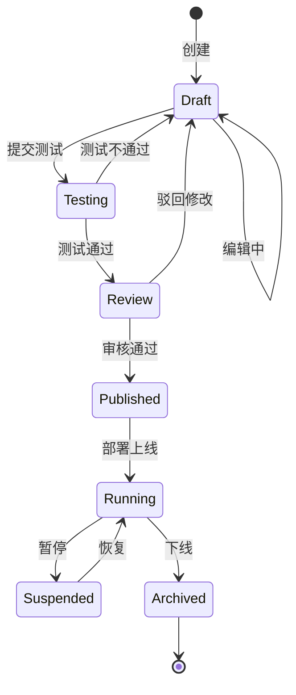

# AI Agent 平台 (aPaaS) — 多行业 AI 技术体系架构设计方案

**版本**: v1.0
**日期**: 2026-05-14
**状态**: 设计完成，待审阅

---

## 目录

1. [概述与定位](#1-概述与定位)
2. [总体架构](#2-总体架构)
3. [基础设施层](#3-基础设施层)
4. [AI 能力层](#4-ai-能力层)
5. [Agent 平台层](#5-agent-平台层)
6. [行业解决方案层](#6-行业解决方案层)
7. [平台横切能力](#7-平台横切能力)
8. [技术选型矩阵](#8-技术选型矩阵)
9. [部署架构与演进路线](#9-部署架构与演进路线)

---

## 1. 概述与定位

### 1.1 产品定位

本产品定位为**面向多行业的 AI Agent 平台型产品（aPaaS — AI Platform as a Service）**，客户可基于平台自助构建、运行、管理面向自身业务的 AI Agent 和智能应用。

定位一句话：**让每个行业的企业都能像搭建 SaaS 工作流一样搭建 AI 数字员工。**

```
           ┌──────────────────────────────────┐
           │        AI Agent Platform          │
           │        (AI Agent aPaaS)           │
           │                                  │
           │  行业客户 → 构建/运行/管理 Agent     │
           │  伙伴/ISV → 开发行业技能/连接器      │
           │  企业开发者 → API/低代码接入         │
           └──────────────────────────────────┘
```

### 1.2 目标客户画像

| 层级 | 典型客户 | 核心诉求 | 付费能力 |
|------|---------|---------|---------|
| **大型企业** | 行业龙头，年营收 10 亿+ | AI 能力私有化部署、行业 know-how 封装、安全合规 | 强，百万级/年 |
| **中型企业** | 行业腰部，年营收 1-10 亿 | 快速落地 AI 场景、开箱即用的行业 Agent 模板、降低 AI 人才门槛 | 中，10-50 万/年 |
| **ISV/伙伴** | 行业软件开发/咨询公司 | 基于平台二次开发行业方案、技能市场变现、联合交付 | 中等，按分成/授权 |

**初期切入行业**（依据团队基因选择）：
- **第一梯队**：物流/供应链（存量优势）、金融（高付费意愿 + 合规刚需）
- **第二梯队**：制造、零售、政务

### 1.3 核心价值主张

本平台填平的核心鸿沟：**"把大模型能力 → 封装成行业可用的数字员工 → 业务直接使用"**

| 价值点 | 传统方式 | 本平台方式 |
|--------|---------|-----------|
| **降门槛** | 需要 ML 工程师 + 后端 + 前端组队开发 | 业务人员可对话式构建 Agent，开发者可 Pro-Code 定制 |
| **行业化** | 通用模型+通用 Prompt，不懂行业术语和规则 | 行业知识库预置+行业连接器+行业 Agent 模板 |
| **可治理** | 黑盒调用，不知道 Agent 做了什么决策 | 全链路可观测+评估体系+合规审计 |

### 1.4 对标分析

| 维度 | 本平台 | Salesforce Agentforce | Manhattan Agent Foundry | Dify/Coze |
|------|--------|----------------------|------------------------|-----------|
| **行业深度** | ⭐⭐⭐⭐⭐ 多行业预置 | ⭐⭐⭐ CRM 行业 | ⭐⭐⭐⭐ 供应链行业 | ⭐ 通用 |
| **客户自建 Agent** | ⭐⭐⭐⭐⭐ 核心能力 | ⭐⭐⭐⭐ 自然语言+工具链 | ⭐⭐⭐⭐⭐ 三种构建路径 | ⭐⭐⭐⭐ 可视化 |
| **独立产品化** | ⭐⭐⭐⭐⭐ 独立售卖 | ❌ SF 生态绑定 | ❌ Manhattan Active 绑定 | ⭐⭐⭐ 开源/云 |
| **企业级安全** | ⭐⭐⭐⭐⭐ 私有化部署 | ⭐⭐⭐⭐ | ⭐⭐⭐⭐ | ⭐⭐ |
| **中国市场适配** | ⭐⭐⭐⭐⭐ | ⭐ | ⭐ | ⭐⭐ |
| **伙伴生态** | ⭐⭐ 起步阶段 | ⭐⭐⭐⭐⭐ AppExchange | ⭐⭐⭐ Agent Marketplace | ⭐⭐⭐ 插件市场 |

**差异化卡位**：在通用 Agent 平台（Dify/Coze）和国际垂直 Agent（Agentforce/Manhattan）之间，做一个**中国市场原生的、跨行业可复用的 AI Agent 平台层**。

---

## 2. 总体架构

### 2.1 四层融合架构全景

```
┌──────────────────────────────────────────────────────────────────────────┐
│                        🔗 开放集成 & 开发者体验                           │
│  REST API │ gRPC │ WebSocket │ MCP │ A2A │ SDK(Python/JS/Java) │ CLI    │
├──────────────────────────────────────────────────────────────────────────┤
│                                                                          │
│  ┌──────────────────────────────────────────────────────────────────┐   │
│  │              行业解决方案层 Industry Solutions                      │   │
│  │                                                                   │   │
│  │  ┌─────────┐ ┌─────────┐ ┌─────────┐ ┌─────────┐ ┌─────────┐    │   │
│  │  │ 物流方案 │ │ 金融方案 │ │ 制造方案 │ │ 零售方案 │ │ 政务方案 │    │   │
│  │  │ 预置Agent│ │ 预置Agent│ │ 预置Agent│ │ 预置Agent│ │ 预置Agent│    │   │
│  │  │ 行业知识库│ │ 合规规则库│ │ 设备连接器│ │ 商品图谱 │ │ 公文模板 │    │   │
│  │  └─────────┘ └─────────┘ └─────────┘ └─────────┘ └─────────┘    │   │
│  └──────────────────────────────────────────────────────────────────┘   │
│                                    │                                     │
│  ┌──────────────────────────────────────────────────────────────────┐   │
│  │              Agent 平台层 Agent Platform (核心引擎)                 │   │
│  │                                                                   │   │
│  │  ┌──────────┐ ┌──────────┐ ┌──────────┐ ┌──────────┐             │   │
│  │  │ Agent    │ │ 编排引擎  │ │ 技能市场  │ │ 评估监控  │             │   │
│  │  │ 生命周期 │ │Orchestra- │ │Skill     │ │Eval &     │             │   │
│  │  │ Lifecycle│ │tion Engine│ │Marketplace│ │Monitor    │             │   │
│  │  └──────────┘ └──────────┘ └──────────┘ └──────────┘             │   │
│  │  ┌──────────┐ ┌──────────┐ ┌──────────┐ ┌──────────┐             │   │
│  │  │ 对话管理  │ │ 记忆系统  │ │ 权限安全  │ │ Agent    │             │   │
│  │  │ Dialog   │ │ Memory   │ │ Security │ │ Router   │             │   │
│  │  └──────────┘ └──────────┘ └──────────┘ └──────────┘             │   │
│  └──────────────────────────────────────────────────────────────────┘   │
│                                    │                                     │
│  ┌──────────────────────────────────────────────────────────────────┐   │
│  │                AI 能力层 AI Capabilities                           │   │
│  │                                                                   │   │
│  │  ┌──────────┐ ┌──────────┐ ┌──────────┐ ┌──────────┐             │   │
│  │  │ 模型网关  │ │ RAG引擎  │ │ Prompt   │ │ 知识图谱  │             │   │
│  │  │Model     │ │ Retrieval│ │ 管理中心  │ │Knowledge │             │   │
│  │  │ Gateway  │ │ Engine   │ │ Prompt Hub│ │ Graph    │             │   │
│  │  └──────────┘ └──────────┘ └──────────┘ └──────────┘             │   │
│  │  ┌──────────┐ ┌──────────┐ ┌──────────┐ ┌──────────┐             │   │
│  │  │ MLOps    │ │ 评估引擎  │ │ 数据管道  │ │ 缓存层    │             │   │
│  │  │ Pipeline │ │ Eval     │ │ Data     │ │ Semantic │             │   │
│  │  │          │ │ Engine   │ │ Pipeline │ │ Cache    │             │   │
│  │  └──────────┘ └──────────┘ └──────────┘ └──────────┘             │   │
│  └──────────────────────────────────────────────────────────────────┘   │
│                                    │                                     │
│  ┌──────────────────────────────────────────────────────────────────┐   │
│  │                基础设施层 Infrastructure                            │   │
│  │                                                                   │   │
│  │  ┌──────────┐ ┌──────────┐ ┌──────────┐ ┌──────────┐             │   │
│  │  │ GPU集群  │ │ 向量数据库│ │ 图数据库  │ │ 消息队列  │             │   │
│  │  │ GPU Pool │ │ Vector DB│ │ Graph DB │ │ Message Q│             │   │
│  │  └──────────┘ └──────────┘ └──────────┘ └──────────┘             │   │
│  │  ┌──────────┐ ┌──────────┐ ┌──────────┐ ┌──────────┐             │   │
│  │  │ 对象存储  │ │ 关系数据库│ │ 安全网关  │ │ 可观测性  │             │   │
│  │  │ Object   │ │ RDMS    │ │ Security │ │ Observe  │             │   │
│  │  └──────────┘ └──────────┘ └──────────┘ └──────────┘             │   │
│  └──────────────────────────────────────────────────────────────────┘   │
│                                                                          │
│  ┌──────────────────────────────────────────────────────────────────┐   │
│  │                    平台横切能力 Cross-Cutting                       │   │
│  │  多租户隔离 │ 计费计量 │ 身份认证 │ 审计日志 │ 配置中心 │ 文档中心    │   │
│  └──────────────────────────────────────────────────────────────────┘   │
└──────────────────────────────────────────────────────────────────────────┘
```

### 2.2 设计原则

| # | 原则 | 含义 | 架构体现 |
|---|------|------|---------|
| **P1** | **层次解耦** | 每一层有明确的接口契约，可独立演进和替换 | 层间通过标准 API/gRPC 通信，不允许跨层穿透调用 |
| **P2** | **Agent 原生** | 平台一切能力围绕 Agent 构建，"一切皆可被 Agent 调用" | 能力层全部封装为 Tool/Skill，Agent 通过统一协议调用 |
| **P3** | **行业可插拔** | 新行业接入无平台改造，通过配置+预置包完成 | 行业方案层与平台层解耦，通过 ISV SDK 和行业包机制 |
| **P4** | **企业级就绪** | 第一天就考虑多租户、安全、审计、高可用 | 横切能力层独立设计，不在业务逻辑中散落 |
| **P5** | **渐近式消费** | 客户可从任意一层进入，不必全栈采纳 | 每层提供独立 API，能力层和 Agent 层可独立售卖 |
| **P6** | **开放生态** | 不做 walled garden，拥抱标准协议 | 支持 MCP、A2A、OpenAI API 兼容协议 |

### 2.3 核心技术决策

| # | 决策点 | 选项 | 选择 | 理由 |
|---|--------|------|------|------|
| **D1** | Agent 框架 | LangGraph / CrewAI / 自研 | **自研轻量引擎 + LangGraph 内核** | 需要深度定制（多 Agent 协作、行业工作流），但复用社区的图编排能力 |
| **D2** | 模型接入模式 | 单一供应商 / 多模型网关 | **多模型网关** | 客户需要模型选择自由，且不同场景最优模型不同 |
| **D3** | 内存/状态管理 | 无状态 / 有状态 Agent | **有状态 + 分层记忆** | B2B 场景需要长对话上下文、跨会话记忆、行业知识持久化 |
| **D4** | 技能扩展机制 | 代码级插件 / 声明式配置 | **声明式 + 代码级双模** | 简单技能声明式（API 调用），复杂技能支持自定义代码 |
| **D5** | 部署模式 | 纯 SaaS / 纯私有化 / 混合 | **混合部署** | 大客户需要私有化（数据不出域），中小企业接受 SaaS |
| **D6** | 多租户隔离 | 逻辑隔离 / 物理隔离 | **逻辑隔离 + 可升级物理隔离** | 中小客户逻辑隔离降成本，大客户可选专属实例 |
| **D7** | 消息协议 | REST / gRPC / MCP / A2A | **多协议共存** | REST=外部集成, gRPC=内部服务, MCP=技能连接, A2A=Agent 间通信 |

### 2.4 请求链路全景

```
用户请求 → API Gateway → Agent Router → Orchestration Engine
                                              │
                    ┌─────────────────────────┼─────────────────────────┐
                    ▼                         ▼                          ▼
              Skill Executor           LLM Call (via Model Gateway)  Memory Recall
                    │                         │                          │
                    ▼                         ▼                          ▼
              Tool/Skill Registry      Model Gateway                Memory Store
              (MCP/A2A/API)            ├─ Router (fallback/retry)    ├─ Short-term (Redis)
                                       ├─ Rate Limiter               ├─ Long-term (Vector DB)
                                       ├─ Response Cache             └─ Knowledge Graph
                                       └─ Audit Logger
```

---

## 3. 基础设施层

### 3.1 定位与边界

基础设施层的职责：**为上层提供稳定、弹性、安全的算力与数据底座**，对上层完全透明——上层不感知 GPU 是 A100 还是 H100，不感知向量库是 Milvus 还是 Qdrant。

### 3.2 GPU 推理集群

```
┌─────────────────────────────────────────────────────────────┐
│                    GPU 集群调度层                             │
│  ┌─────────────────────────────────────────────────────┐    │
│  │               Model Scheduler                        │    │
│  │  ┌───────────┐  ┌───────────┐  ┌───────────┐        │    │
│  │  │ 模型冷热管理│  │ GPU 亲和性 │  │ 优先级抢占 │        │    │
│  │  │ Cold/Warm │  │ Affinity  │  │ Preemption│        │    │
│  │  └───────────┘  └───────────┘  └───────────┘        │    │
│  └─────────────────────────────────────────────────────┘    │
│                          │                                   │
│  ┌─────────────────────────────────────────────────────┐    │
│  │              推理引擎 Runtime                         │    │
│  │  ┌────────┐ ┌────────┐ ┌────────┐ ┌────────┐        │    │
│  │  │ vLLM   │ │ TGI    │ │ Triton │ │ 自研    │        │    │
│  │  │(高吞吐)│ │(Hugging│ │(NVIDIA)│ │ (特定   │        │    │
│  │  │        │ │ Face)  │ │        │ │ 模型)   │        │    │
│  │  └────────┘ └────────┘ └────────┘ └────────┘        │    │
│  └─────────────────────────────────────────────────────┘    │
│                          │                                   │
│  ┌─────────────────────────────────────────────────────┐    │
│  │            物理 GPU 资源池                             │    │
│  │  自建集群(A100/H100/B200) │ 云厂商 GPU │ 边缘 GPU(T4)   │    │
│  └─────────────────────────────────────────────────────┘    │
└─────────────────────────────────────────────────────────────┘
```

| 能力 | 设计 | 说明 |
|------|------|------|
| **模型冷热管理** | 三级缓存调度 | Hot(常驻 GPU) → Warm(5s 加载) → Cold(按需拉取，30s) |
| **GPU 亲和性** | 同模型请求尽量路由到同一 GPU | 复用 KV Cache，延迟降低 40%+ |
| **优先级抢占** | 在线推理 > 离线评估 > 模型训练 | 保障生产 SLA，离线任务填充空闲算力 |
| **弹性伸缩** | HPA 基于队列深度 + GPU 利用率 | 最小 0（无请求零成本），最大配额内自动扩 |
| **异构支持** | NVIDIA + 国产芯片（昇腾/寒武纪） | 信创合规客户可选国产芯片池 |

### 3.3 向量数据库

```
                    ┌──────────────────┐
                    │  Vector DB Proxy │  ← 统一入口，屏蔽底层差异
                    │  (读写分离+路由)   │
                    └──────┬───────────┘
           ┌───────────────┼───────────────┐
           ▼               ▼               ▼
    ┌────────────┐ ┌────────────┐ ┌────────────┐
    │  Milvus    │ │  Qdrant    │ │  Elastic   │
    │  (十亿级)  │ │  (轻量高性能)│ │  (混合检索) │
    │  主存储    │ │  缓存层    │ │  BM25+向量 │
    └────────────┘ └────────────┘ └────────────┘
```

| 存储类型 | 选型 | 用途 | 规模设计 |
|---------|------|------|---------|
| **主向量存储** | Milvus (分布式) | 行业知识库、Long-term Memory、技能索引 | 单租户隔离 Collection，支持十亿级 |
| **热数据缓存** | Qdrant (单节点) | 最近 7 天会话向量、高频检索缓存 | 内存映射，P99 < 5ms |
| **混合检索** | Elasticsearch | BM25 关键词 + 向量混合召回 | 与 Milvus 互补，覆盖精确匹配场景 |

**多租户隔离策略**：
```
Collection 粒度：
  SaaS 客户 → 共享 Collection + partition_key 隔离（降低成本）
  私有化客户 → 独立 Collection（物理隔离）
```

### 3.4 图数据库

| 数据类别 | 存储 | 典型查询 |
|---------|------|---------|
| 行业知识图谱 | Neo4j | "客户 A 的供应商 B 在去年 Q4 的准时率？" → 实体-关系-属性链 |
| Agent 协作拓扑 | Neo4j | 多 Agent 编排的 DAG 依赖、循环检测 |
| 权限关系图 | PostgreSQL + 递归 CTE | "此用户能访问哪些 Agent 的执行结果？" |
| 技能依赖图 | Neo4j | "更新技能 X 会影响哪些 Agent？" → 影响分析 |

### 3.5 消息中间件

```
┌──────────────────────────────────────────────────┐
│               Event Bus (Kafka / Pulsar)          │
│                                                   │
│  ┌─────────────┐ ┌─────────────┐ ┌─────────────┐  │
│  │ Agent 事件流 │ │ 系统事件流   │ │ 业务事件流   │  │
│  │ - Agent 状态 │ │ - 模型上下线 │ │ - 行业数据   │  │
│  │ - 步骤推进   │ │ - 计费事件   │ │   变更通知   │  │
│  │ - 评估结果   │ │ - 审计日志   │ │              │  │
│  └─────────────┘ └─────────────┘ └─────────────┘  │
│                                                   │
│  Topic 隔离：<tenant_id>.<event_type>.<resource>   │
│  保留策略：Agent 事件 7 天 / 审计事件 365 天         │
└──────────────────────────────────────────────────┘
```

**设计要点**：
- **Agent 事件溯源**：所有 Agent 状态变更写入事件流，支持重放和回溯
- **异步解耦**：Agent 执行 → 评估 → 计费 → 审计，通过事件流异步串联，不阻塞主链路
- **可靠投递**：At-least-once + 幂等消费、死信队列（DLQ）兜底

### 3.6 对象存储与关系数据库

```
┌────────────────────────────────────────────────┐
│              数据存储矩阵                        │
│                                                │
│  热数据 (Redis Cluster)                         │
│  ├─ 会话状态 (Session Context)     TTL: 会话+30m │
│  ├─ 推理缓存 (Semantic Cache)       TTL: 按策略   │
│  ├─ 限流计数器 (Rate Limiter)       TTL: 窗口时长 │
│  └─ 分布式锁 (Agent 并发控制)        TTL: 按需     │
│                                                │
│  温数据 (PostgreSQL + 读写分离)                  │
│  ├─ Agent 定义/版本                 永久          │
│  ├─ 技能注册/元数据                永久          │
│  ├─ 租户配置/权限                  永久          │
│  ├─ 计费记录                       3 年          │
│  └─ 评估结果                       1 年          │
│                                                │
│  冷数据 (MinIO / S3 兼容)                       │
│  ├─ Agent 运行日志                 按策略归档     │
│  ├─ 模型权重文件                   永久          │
│  ├─ 知识库原始文档                 永久          │
│  └─ 审计归档                      7 年 (合规)    │
└────────────────────────────────────────────────┘
```

### 3.7 安全网关

```
外部请求 → WAF → DDoS 防护 → API Gateway
                              │
                    ┌─────────┼─────────┐
                    ▼         ▼         ▼
              身份认证    权限校验    数据脱敏
              (OIDC/OAuth) (RBAC+ABAC) (PII Masking)
                              │
                    ┌─────────┼─────────┐
                    ▼         ▼         ▼
              速率限制    内容安全    注入检测
              (Token Bucket) (LLM Firewall) (Prompt Injection)
```

| 安全层次 | 组件 | 职责 |
|---------|------|------|
| **边缘防护** | WAF + API Gateway | 防 DDoS、IP 黑白名单、TLS 终结 |
| **身份认证** | Keycloak / Auth0 | OIDC/OAuth2.0、SAML 企业 SSO、MFA |
| **权限控制** | OpenFGA / OPA | RBAC(角色) + ABAC(属性) + ReBAC(关系) |
| **内容安全** | LLM Firewall (自研) | 输入检测(Prompt Injection / Jailbreak)、输出检测(敏感信息泄露 / 有害内容) |
| **数据安全** | 加解密服务 + KMS | 传输 TLS 1.3、存储 AES-256、密钥轮换 |

### 3.8 可观测性

```
┌──────────────────────────────────────────────────────────┐
│                 可观测性三支柱                              │
│                                                          │
│  📊 Metrics (Prometheus + Grafana)                       │
│  ├─ 模型网关: 请求量/延迟(P50/P95/P99)/错误率/Token 消耗   │
│  ├─ GPU 集群: GPU 利用率/显存/温度/队列深度                │
│  ├─ Agent: 成功率/平均步数/耗时/Token 效率                 │
│  └─ 业务: Agent 活跃数/客户使用量/SLA 达标率               │
│                                                          │
│  📝 Tracing (OpenTelemetry + Jaeger)                     │
│  ├─ Agent 执行链路: 用户请求 → Agent Router → LLM → Tool  │
│  ├─ RAG 召回链路: Query → Embedding → Search → Rerank    │
│  └─ 模型调用链路: Gateway → Router → Engine → Response   │
│                                                          │
│  📋 Logging (Loki + 结构化日志)                           │
│  ├─ Agent 步骤日志 (JSON Schema 标准化)                   │
│  ├─ 模型调用日志 (Prompt + Response + Token 统计)         │
│  ├─ 审计日志 (谁/何时/做了什么) → 合规必备                  │
│  └─ 错误日志 (堆栈 + 上下文快照)                           │
└──────────────────────────────────────────────────────────┘
```

**Agent 专属可观测性**（区别于传统微服务）：

| 独有指标 | 说明 |
|---------|------|
| **Agent 成功率** | Agent 任务完成率（含部分成功 / 降级完成） |
| **幻觉率** | 引用来源与生成内容的一致性评分 |
| **Tool 调用准确率** | 是否在正确时机选择了正确的 Tool |
| **Token 效率** | 完成任务的实际 Token 消耗 vs 预算 |
| **用户干预率** | Agent 执行中需要人工介入的频率 |

---

## 4. AI 能力层

### 4.1 定位与边界

AI 能力层是平台的**技术中台**，给 Agent 层提供原子化的 AI 能力：模型调用、知识检索、Prompt 管理、知识图谱查询。

核心原则：**能力原子化、接口标准化、质量可度量**。每一能力模块独立部署、独立 scaling、独立计费。

### 4.2 模型网关 (Model Gateway)

#### 架构

```
                        ┌──────────────────────┐
                        │   Agent / Application │
                        └──────────┬───────────┘
                                   │
                        ┌──────────▼───────────┐
                        │   Model Gateway       │
                        │                       │
          ┌─────────────┤  POST /v1/chat        ├─────────────┐
          │             │  (OpenAI API 兼容)     │             │
          ▼             └───────────────────────┘             ▼
  ┌───────────────┐                                  ┌───────────────┐
  │  Control Plane │                                  │  Data Plane   │
  │               │                                  │               │
  │ - 模型注册     │                                  │ - 请求路由     │
  │ - 配额管理     │                                  │ - 负载均衡     │
  │ - 供应商管理   │                                  │ - 限流熔断     │
  │ - 成本追踪     │                                  │ - 响应缓存     │
  │ - Fallback策略│                                  │ - 协议转换     │
  └───────────────┘                                  └───────────────┘
                                                            │
                    ┌───────────────────────────────────────┤
                    ▼               ▼               ▼
             ┌──────────┐  ┌──────────┐  ┌──────────────┐
             │ 外部 LLM  │  │ 私有模型  │  │ 国产芯片模型  │
             │ OpenAI    │  │ vLLM     │  │ 昇腾/寒武纪   │
             │ Anthropic │  │ TGI      │  │              │
             │ DeepSeek  │  │          │  │              │
             │ 通义/文心  │  │          │  │              │
             └──────────┘  └──────────┘  └──────────────┘
```

#### 智能路由

```
路由策略矩阵:
┌────────────┬──────────┬──────────┬──────────┬──────────┐
│ 场景        │ 速度优先  │ 质量优先  │ 成本优先  │ 合规优先  │
├────────────┼──────────┼──────────┼──────────┼──────────┤
│ 简单对话    │ DeepSeek │ Claude   │ DeepSeek │ 私有模型  │
│ 复杂推理    │ Claude   │ Claude   │ DeepSeek │ 私有模型  │
│ 代码生成    │ DeepSeek │ Claude   │ DeepSeek │ 私有模型  │
│ 长文本理解  │ Gemini   │ Claude   │ DeepSeek │ 私有模型  │
│ 嵌入向量    │ 本地模型  │ 本地模型  │ 本地模型  │ 本地模型  │
│ 合规场景    │ —        │ —        │ —        │ 私有模型  │
└────────────┴──────────┴──────────┴──────────┴──────────┘
```

#### Fallback 链

```
主模型超时/限流/错误
    │
    ▼
同供应商重试 (x1, backoff 1s)
    │ (失败)
    ▼
同级别备选模型 (如 Claude → DeepSeek)
    │ (失败)
    ▼
降级模型 (→ 轻量模型, 返回简化答案 + 标记 degraded)
    │ (失败)
    ▼
返回友好错误 + 告警
```

#### 关键设计决策

| 决策 | 选择 | 理由 |
|------|------|------|
| API 协议 | OpenAI API 兼容 (/v1/chat/completions) | 生态兼容性最强，LangChain/LlamaIndex 等框架零成本接入 |
| 模型注册 | 声明式 YAML 配置 + Admin UI | 新模型接入不需要改代码 |
| 多供应商 | 统一抽象层，每供应商一个 Adapter | 新增供应商只需实现 Adapter 接口 |
| 缓存策略 | 语义缓存 (Semantic Cache)，非精确匹配 | LLM 场景精确匹配命中率极低，语义相似匹配可提升 20-30% 缓存命中 |
| 限流策略 | Token Bucket，租户+模型双维度 | 防止单租户打爆某个模型，保障公平性 |

### 4.3 RAG 引擎

#### 检索增强生成流水线

```
                         ┌──────────┐
                         │  Query   │
                         └────┬─────┘
                              │
              ┌───────────────▼───────────────┐
              │        Query 理解              │
              │  ├─ Query Rewrite (LLM改写)    │
              │  ├─ Query Decompose (拆解)     │
              │  └─ Intent Classify (分类)     │
              └───────────────┬───────────────┘
                              │
              ┌───────────────▼───────────────┐
              │        多路召回                │
              │  ├─ 向量召回 (Milvus)          │
              │  ├─ 关键词召回 (Elasticsearch)  │
              │  ├─ 图召回 (Neo4j 知识图谱)     │
              │  └─ 结构化查询 (SQL 自动生成)   │
              └───────────────┬───────────────┘
                              │
              ┌───────────────▼───────────────┐
              │        融合排序 (Rerank)       │
              │  ├─ Cross-Encoder 精排         │
              │  ├─ 时效性加权                 │
              │  ├─ 权限过滤                  │
              │  └─ 多样性去重                 │
              └───────────────┬───────────────┘
                              │
              ┌───────────────▼───────────────┐
              │       上下文组装               │
              │  ├─ Chunk 合并 (相邻片段拼接)   │
              │  ├─ 引用标记                   │
              │  └─ Prompt 模板注入            │
              └───────────────┬───────────────┘
                              │
                         ┌────▼────┐
                         │   LLM   │
                         └─────────┘
```

#### 分块策略矩阵

| 文档类型 | 分块策略 | Chunk Size | Overlap | 特殊处理 |
|---------|---------|------------|---------|---------|
| 技术文档/Markdown | 按标题层级切分 | 512 tokens | 50 | 保留标题层级路径 |
| 法律合同 | 按条款切分 | 1024 tokens | 100 | 条款编号索引 |
| 表格数据 | 按行+上下文切分 | 按表格 | — | 保留表头+行号 |
| 代码 | AST 语法树切分 | 按函数/类 | 0 | 保留导入和类型定义 |
| 对话记录 | 按轮次切分 | 按轮次 | 前1轮 | 保留角色和时间戳 |

#### 行业知识库模型

```
租户 A (物流)              租户 B (金融)              租户 C (制造)
┌─────────────────┐    ┌─────────────────┐    ┌─────────────────┐
│ 📁 物流知识库     │    │ 📁 金融知识库     │    │ 📁 制造知识库     │
│ ├─ SOP 文档      │    │ ├─ 监管法规       │    │ ├─ 工艺规范       │
│ ├─ 运价表        │    │ ├─ 产品说明书     │    │ ├─ 设备手册       │
│ ├─ 报关规则       │    │ ├─ 合规检查清单   │    │ ├─ 质检标准       │
│ ├─ 路线数据       │    │ ├─ 授信政策       │    │ └─ BOM 清单      │
│ └─ 承运商合同     │    │ └─ 风控规则       │    │                  │
│                  │    │                  │    │                  │
│ 平台预置模板      │    │ 平台预置模板      │    │ 平台预置模板      │
│ + 客户私有数据    │    │ + 客户私有数据    │    │ + 客户私有数据    │
└─────────────────┘    └─────────────────┘    └─────────────────┘
```

### 4.4 Prompt 管理中心 (Prompt Hub)

#### 生命周期

```
Draft → Review → A/B Test → Published → Deprecated
  │                 │
  └──── Rollback ───┘        ┌── Archived

版本管理: major.minor (semver)
变量系统: {{user_name}} {{context}} {{industry}}
继承机制: Base Prompt → Industry Prompt → Tenant
```

#### Prompt 模板示例

```yaml
id: prompt-logistics-cs-v2.3
name: 物流客服系统提示词
version: 2.3.0
base: prompt-customer-service-base-v1.0
industry: logistics
variables:
  - name: company_name
    type: string
    source: tenant_config
  - name: sop_docs
    type: knowledge_base
    source: rag_retrieval
    top_k: 5
model_constraints:
  min_tokens: 512
  temperature: 0.3
evaluation:
  benchmark: logistics_cs_eval_set
  min_score: 0.85
template: |
  你是{{company_name}}的物流智能助手。
  
  处理原则：
  1. 优先从标准作业流程(SOP)中查找答案
  2. 涉及赔偿/投诉，严格按规章制度回复
  3. 无法处理的问题，引导客户联系人工客服
  
  参考知识：
  {{sop_docs}}
```

#### 评估闭环

```
新 Prompt 版本上线                   线上运行
      │                                │
      ▼                                ▼
  评估集测试                      收集效果指标
  (回归测试)                      (采纳率/满意度/转人工率)
      │                                │
      ▼                                ▼
  Score ≥ 0.85?               Score 下降 > 5%?
      │                                │
  是→发布  否→回退              是→自动告警→人工介入
```

### 4.5 知识图谱引擎

与 RAG 的非结构化检索互补，知识图谱解决**结构化关系推理**场景：

- RAG: "仓库 SOP 中入库流程是什么？" → 段落检索 → LLM 回答
- 知识图谱: "客户 A 所有延迟超过 3 天的订单涉及哪些承运商？" → 图遍历 → 精确回答

```
构建流水线:
  非结构化文档 → LLM 实体抽取 → 实体对齐 → 关系抽取
  结构化数据 → Schema Mapping → 批量导入
  人工标注 → 审核校正 → 知识融合

物流行业本体示例:
  (客户A) -[:下单]-> (订单001) -[:包含]-> (商品SKU-123)
                     │
                -[:分配给]-> (承运商B) -[:派遣]-> (车辆C)
                                 │
                            -[:运输途中]-> (GPS轨迹)
                                 │
                            -[:经停]-> (中转仓D) -[:入库]-> (库位E-3-15)
```

### 4.6 MLOps 流水线（Agent 导向）

传统 MLOps 是训练密集型（数据→训练→评估→部署），Agent MLOps 是**迭代密集型**（Prompt→评估→发布→监控→反馈）。

```
Agent MLOps 流水线:
  ┌──────────┐   ┌──────────┐   ┌──────────┐
  │ 评估数据集│   │ 评估执行  │   │ 结果分析  │
  │ Dataset  │──▶│ Eval Run │──▶│ Analysis │
  └──────────┘   └──────────┘   └──────────┘
                                    │
                      ┌─────────────┼──────────┐
                      ▼             ▼          ▼
                  Pass          Warning     Fail
                   │              │          │
                   ▼              ▼          ▼
                自动发布      人工审核    阻断发布

评估维度:
  ├─ 准确性: 答案正确率、引用准确率
  ├─ 安全性: 有害内容率、越狱成功率
  ├─ 效率: 平均步数、Token 消耗
  ├─ 体验: 用户满意度、任务完成率
  └─ 一致性: 同 Query 多次结果一致性
```

### 4.7 语义缓存层

```
请求流入
    │
    ▼
精确匹配缓存? ──Yes──▶ 直接返回 (命中率 ~5%)
    │ No
    ▼
语义相似度计算 (Embedding Cosine Similarity)
    │
    ├─ Similarity > 0.95 → 返回缓存结果 + 标记 cached
    ├─ Similarity > 0.85 → 返回缓存结果 + 追加差异补充
    └─ Similarity < 0.85 → 调用 LLM + 结果写入缓存

典型命中率: 20-35% (企业场景同质化问题占比高)
```

---

## 5. Agent 平台层

### 5.1 定位

Agent 平台层是产品的**核心引擎**：让 Agent 被构建、运行、管理和复用。

### 5.2 Agent 生命周期



| 阶段 | 触发者 | 关键行为 | 产出物 |
|------|--------|---------|--------|
| **Draft** | 构建者 | 配置 Agent 定义、选择技能、编写 Prompt | Agent 草稿 |
| **Testing** | 系统自动 | 评估集自动测试、回归测试 | 评估报告 |
| **Review** | 审核者 | 人工审核评估结果、审批发布 | 审批记录 |
| **Published** | 系统 | 版本锁定、镜像打包 | Agent 版本快照 |
| **Running** | 运维/系统 | 部署、监控、自动扩缩 | 运行实例 |

### 5.3 Agent 构建方式（三级）

| 方式 | 目标用户 | 实现 | 覆盖预期 |
|------|---------|------|---------|
| **对话式构建 (No-Code)** | 业务人员 | "帮我创建一个能回答仓库 SOP 的助手" → LLM 自动选技能、配 Prompt、建议测试 | 30% |
| **可视化编排 (Low-Code)** | 业务分析师 | 拖拽式工作流 + 预置模板定制 | 50% |
| **Pro-Code** | 开发者 | Python/JS SDK + CLI，完全控制 | 20% |

### 5.4 Agent 定义 DSL

```yaml
apiVersion: agent.platform/v1
kind: Agent
metadata:
  name: logistics-exception-handler
  version: 2.1.0
  industry: logistics
spec:
  model:
    primary: claude-opus-4-7
    fallback: deepseek-v4
    temperature: 0.3
    max_tokens: 4096
  
  prompt:
    ref: prompt-logistics-exception-v2
  
  skills:
    - ref: skill-track-query
      required: true
    - ref: skill-abnormal-detection
      required: true
    - ref: skill-customer-notify
      required: false
  
  knowledge:
    - ref: kb-logistics-sop
      retrieval_top_k: 5
  
  memory:
    short_term: { max_turns: 20, ttl: 3600 }
    long_term: { enabled: true, scope: tenant }
  
  execution:
    max_steps: 15
    timeout: 120s
    
    human_approval:
      enabled: true
      triggers:
        - action: cancel_order
        - amount_gt: 10000
        - confidence_lt: 0.8
  
  evaluation:
    dataset: eval-logistics-exception
    min_score: 0.85
```

### 5.5 编排引擎

#### 编排策略层次

| 策略 | 场景 | 示例 |
|------|------|------|
| **Simple** | 单步对话，无工具调用 | 问答 |
| **Chain** | 顺序管道，固定流程 | 入库六步流程 |
| **Router** | 条件分支，规则/LLM 判定 | 异常分级路由 |
| **Graph** | 复杂 DAG，多路并行+汇聚 | 多 Agent 协作 |

#### 多 Agent 协作模式

1. **Sequential**: [Agent A] → [Agent B] → [Agent C] (客服→路由→通知)
2. **Router**: 根据行业/意图分发到对应 Agent
3. **Hierarchical**: Supervisor Agent 分配子任务+汇总结果
4. **Mesh**: 复杂跨部门流程网状协作
5. **Debate**: 多 Agent 交叉验证 (风险评估、合规审查)

#### 协作协议

| 协议 | 用途 | 优先级 |
|------|------|--------|
| **A2A** | Agent 间任务委托和状态同步 | 优先支持 |
| **MCP** | Agent 调用外部 Tool/Skill | 优先支持 |
| **内部 gRPC** | 平台内 Agent 间高性能通信 | 自研 |
| **Webhook** | 结果推送到外部系统 | 标准 HTTP |

### 5.6 技能市场

```
┌─────────────────────────────────────────────────────────┐
│                   技能市场生态                            │
│                                                         │
│  ┌──────────┐    ┌──────────┐    ┌──────────┐          │
│  │ 平台官方  │    │ ISV/伙伴  │    │ 社区/客户 │          │
│  │ 技能      │    │ 技能      │    │ 技能      │          │
│  ├──────────┤    ├──────────┤    ├──────────┤          │
│  │ 基础技能  │    │ 行业技能  │    │ 定制技能  │          │
│  │ - 运单查询│    │ - 报关    │    │ - 内部SOP │          │
│  │ - 天气查询│    │ - 授信审批 │    │ - 特定API │          │
│  │ - 短信通知│    │ - 质检规则 │    │          │          │
│  └──────────┘    └──────────┘    └──────────┘          │
│                                                         │
│  发布流程: 开发 → 测试 → 审核 → 上架 → 版本管理           │
│  计费模式: 免费基础 / 按调用付费 / 按月订阅                │
└─────────────────────────────────────────────────────────┘
```

### 5.7 分层记忆系统

```
┌─────────────────────────────────────────────────┐
│  Working Memory (工作记忆)                        │
│  存储: 当前对话上下文 | 管理: 滑动窗口+自动摘要压缩  │
├─────────────────────────────────────────────────┤
│  Short-Term Memory (短期记忆)                     │
│  存储: Redis | 内容: 当前会话历史 | TTL: 24h      │
├─────────────────────────────────────────────────┤
│  Long-Term Memory (长期记忆)                      │
│  存储: 向量数据库 | 内容: 用户偏好、历史决策、重要事实│
├─────────────────────────────────────────────────┤
│  Knowledge Memory (知识记忆)                       │
│  存储: 知识图谱+向量数据库 | 内容: 行业知识/企业SOP  │
└─────────────────────────────────────────────────┘
```

### 5.8 评估监控体系

**离线评估（发布前）**：
- LLM-as-Judge：准确性、有用性、安全性评分
- 规则断言：格式校验、关键字包含、JSON 有效性、引用完整性
- 人工标注：金标数据、边角案例、对抗样本

**在线监控（发布后）**：
- 实时指标：采纳率、转人工率、平均耗时、Token 效率
- 异常检测：指标突降、幻觉率飙升、P99 延迟恶化
- 反馈回路：👍👎 评分、用户评论、纠错数据

---

## 6. 行业解决方案层

### 6.1 行业包 (Industry Pack) 模型

行业包 = 行业平台的最小交付单元，包含：

```
Industry Pack: logistics-v3.2
├─ 预置 Agent 模板: 异常处理、路径优化、仓储问答、客户服务
├─ 行业知识库: 物流 SOP、报关规则、运价表、承运商 DB
├─ 行业技能: 运单查询、时效预测、异常检测、路线推荐
├─ 行业连接器: TMS/WMS/OMS 对接
├─ Prompt 模板: 物流场景专用 Prompt
├─ 评估集: 物流评测专用用例
└─ 行业数据模型 (Ontology): 实体/关系/术语体系
```

### 6.2 行业接入流程

| 阶段 | 周期 | 任务 |
|------|------|------|
| **Phase 1: 行业调研** | 2-4 周 | Know-how 梳理、竞品对标、本体构建、Top 10 场景识别 |
| **Phase 2: 行业包构建** | 4-8 周 | 知识库构建、Agent 模板开发、技能开发、连接器开发、评估集构建 |
| **Phase 3: 伙伴联合验证** | 4-6 周 | 1-2 家灯塔客户联合打磨、真实场景测试调优、案例产出 |
| **Phase 4: 正式发布** | — | 上架技能市场、Landing Page/Demo、联合推广、运营反馈 |

### 6.3 首批行业 Agent 矩阵

**物流行业**：

| 领域 | Agent | 核心能力 |
|------|-------|---------|
| 运输管理 | 路径优化 Agent | 实时路况+费率、多目标优化、承运商推荐 |
| 运输管理 | 异常处理 Agent | 延迟自动检测、根因分析、升级策略、客户通知 |
| 仓储管理 | 库存巡检 Agent | 库存健康检查、补货建议、效期预警 |
| 仓储管理 | 波次协调 Agent | 波次前检查、问题预警、修复方案 |
| 客户服务 | 智能客服 Agent | 运单查询、异常处理引导、索赔引导 |
| 伙伴结算 | 对账结算 Agent | 运费自动核算、异常差异识别、付款建议 |
| 伙伴结算 | 合规审查 Agent | 报关合规检查、证件有效期、法规变更预警 |

**金融行业**：

| Agent | 核心能力 |
|-------|---------|
| 合规审查 Agent | 监管条例检索、材料合规检查、审查报告生成 |
| 风控评估 Agent | 企业风险画像、异常交易检测、风险评级建议 |
| 智能客服 Agent | 产品咨询、业务办理引导、合规话术 |
| 报告生成 Agent | 尽调报告、授信报告、监管报送 |

### 6.4 多租户隔离

| Tier | 模式 | 隔离度 | 成本 | 适用 |
|------|------|--------|------|------|
| **Tier 1** | 共享 SaaS (Schema 级隔离) | 逻辑隔离 | 低 | <500 用户 |
| **Tier 2** | 专属实例 (K8s Namespace + 独立 DB) | 资源隔离 | 中 | 500-5000 用户 |
| **Tier 3** | 私有化部署 (完全物理隔离) | 物理隔离 | 高 | 无上限 |

### 6.5 连接器生态

| 层级 | 内容 |
|------|------|
| **Layer 1: 行业标准连接器** | 物流(TMS/WMS/OMS)、金融(核心银行/征信/反洗钱)、制造(ERP/MES/SCADA) |
| **Layer 2: 通用连接器** | 数据库(MySQL/PG/Oracle)、文件(SFTP/S3)、消息(Kafka/RabbitMQ)、协作(飞书/钉钉/企微) |
| **Layer 3: 自定义连接器** | 通过 Connector SDK 自行开发，可上架技能市场 |

---

## 7. 平台横切能力

### 7.1 安全合规体系（五层）

| 层次 | 能力 |
|------|------|
| **Layer 1: 基础设施安全** | 镜像扫描、漏洞管理、配置基线、入侵检测 |
| **Layer 2: 网络安全** | WAF、DDoS 防护、IP 黑白名单、VPC 隔离 |
| **Layer 3: 应用安全** | OAuth 2.0/OIDC、RBAC/ABAC、API 限流、SSO、MFA |
| **Layer 4: AI 安全** | Prompt Injection 检测、Jailbreak 防御、有害内容过滤、幻觉检测、Agent 行为边界约束 |
| **Layer 5: 数据安全** | TLS 1.3、AES-256、KMS、PII 脱敏、数据分类分级、数据出境管控 |

### 7.2 计费模型

```
基础平台费 (订阅制):
  Free → Pro → Business → Enterprise

用量计费 (Pay-as-you-go):
  ├─ Token 消耗 (按模型差异化定价)
  ├─ 知识库存储 (GB/月)
  ├─ Agent 调用次数
  └─ 技能市场消费

增值服务:
  ├─ 行业包订阅
  ├─ 专属 GPU 实例
  ├─ 私有化部署 license
  └─ SLA 升级
```

### 7.3 开发者体验

| 工具 | 说明 |
|------|------|
| **SDK** | Python / JS/TS / Java |
| **CLI** | `$ ai agent deploy`、`$ ai skill create` |
| **VS Code 插件** | 一键创建、本地调试 |
| **Agent Playground** | 在线调试沙箱：对话面板 + 调试面板 (Trace/步骤状态/耗时) + 配置面板 + 评估面板 |
| **API Docs** | OpenAPI 规范 + 交互式文档 |

---

## 8. 技术选型矩阵

### 8.1 核心技术栈

| 层级 | 组件 | 选型 | 选型理由 |
|------|------|------|---------|
| **容器编排** | K8s | K8s | 行业标准，混合部署必备 |
| **GPU 推理** | 推理引擎 | vLLM + TGI | vLLM 吞吐最高，TGI 生态兼容好 |
| **向量数据库** | 主存储 | Milvus | 分布式能力强，十亿级规模验证 |
| | 热缓存 | Qdrant | 内存映射，P99 < 5ms |
| **图数据库** | 知识图谱 | Neo4j | 生态最成熟，Cypher 查询最普及 |
| **消息队列** | 事件总线 | Kafka | 生态最广 |
| **缓存** | 分布式 | Redis Cluster | 生态+性能+持久化 |
| **关系数据库** | 业务数据 | PostgreSQL | JSON 支持好，PGVector 复用 |
| **对象存储** | 文件/日志 | MinIO | S3 兼容，私有化部署友好 |
| **模型网关** | LLM 接入 | 自研 LiteLLM 内核 | 轻量级，定制灵活，无框架绑定 |
| **Agent 框架** | 编排引擎 | LangGraph + 自研 | 社区活跃，图编排成熟 |
| **RAG 引擎** | 检索增强 | LlamaIndex + 自研 | 检索管道灵活，可定制性强 |
| **可观测性** | Metrics | Prometheus + Grafana | 标准选型 |
| | Tracing | OpenTelemetry + Jaeger | CNCF 标准 |
| | Logging | Loki + Promtail | 与 Prometheus 统一栈 |
| **安全** | 身份认证 | Keycloak | 开源，支持私有化部署 |
| | 权限 | OpenFGA | ReBAC 支持好，适合 Agent 权限场景 |
| **API 网关** | 流量入口 | APISIX | 性能好，插件丰富 |
| **CI/CD** | 持续交付 | ArgoCD + GitHub Actions | GitOps 模式 |

### 8.2 关键决策

**D1: Agent 编排 — LangGraph + 自研策略层**：LangGraph 提供图编排+Checkpoint 内核能力，在此基础上自研 Simple/Chain/Router/Graph/Debate 策略层。

**D2: 不选 Dify/Coze 作为底座**：行业深度不够、企业级能力欠缺、定制能力有限、生态锁定、商业风险。

**D3: 国产化适配策略**：所有外部依赖通过 Adapter 模式接入，国产替代 = 实现新 Adapter，不改核心逻辑。三级适配：基础设施(国产 GPU/OS/芯片) → 中间件(达梦/OceanBase/RocketMQ) → 模型(通义/文心/智谱/DeepSeek)。

---

## 9. 部署架构与演进路线

### 9.1 SaaS 部署拓扑

```
                         Global LB (DNS Geo-routing)
                                  │
                        API Gateway Cluster
                           (APISIX + WAF)
                ┌─────────┬───────┴───────┬─────────┐
                ▼         ▼               ▼         ▼
          Control Plane  Agent Runtime  AI Service  Infra Services
          (租户/权限/计费) (编排/技能/记忆) (模型网关/RAG) (Milvus/Kafka/Redis)

                          GPU 推理集群 (独立池)
                   ┌──────────┬──────────┬──────────┐
                   │ A100×8   │ H100×8   │ 昇腾×8   │
                   │ (高吞吐)  │ (低延迟)  │ (信创)   │
                   └──────────┴──────────┴──────────┘
```

**私有化部署最小拓扑**：K8s 3-Node Cluster，最低 64 vCPU + 256GB RAM + 1×A100 GPU (或 2×T4)。

### 9.2 分期路线图

```
Phase 1: MVP (0-6月)
  目标: 1 个行业跑通 3 个 Agent 场景
  交付: 模型网关 + 基础RAG + Agent运行时(Simple/Chain) + Prompt管理 + 物流行业3Agent模板
  团队: 后端4 + AI3 + 前端2 + DevOps1

Phase 2: 平台化 (6-12月)
  目标: Agent 平台完备，3 个行业可用
  交付: 全生命周期 + Router/Graph编排 + 技能市场 + 分层记忆 + 评估体系 + 多租户计费 + 私有化
  团队: 后端8 + AI6 + 前端4 + DevOps2

Phase 3: 生态化 (12-24月)
  目标: 平台生态成形，伙伴可自建行业方案
  交付: 多Agent协作(Hierarchical/Debate) + 知识图谱 + ISV伙伴平台 + 6+行业方案 + 信创适配 + 多活
  团队: 后端12 + AI10 + 前端6 + DevOps3

Phase 4: 智能化 (24-36月)
  目标: AI 自主驱动平台运营，Agent 自我进化
  交付: Agent自动优化 + 跨Agent学习 + 行业知识自动发现 + Agent间市场 + 全球化部署
```

### 9.3 组织架构

```
                    AI 平台负责人
                         │
         ┌───────────────┼───────────────┐
         ▼               ▼               ▼
    平台工程组          AI 算法组        行业方案组
    (基础设施/网关/     (Agent引擎/模型   (物流/金融/制造
     安全/多租户/       网关/RAG/知识      /伙伴赋能/解决
     开发者工具)        图谱/评估)        方案架构)
         │               │               │
         └───────────────┼───────────────┘
                         ▼
                 产品 & 设计
                 (PM×2 + UX×2 + Tech Writer×1)
```

### 9.4 关键风险与缓解

| 风险 | 影响 | 概率 | 缓解措施 |
|------|------|------|---------|
| **模型能力瓶颈** | 高 | 中 | 多模型网关+Falback，不绑定单一供应商 |
| **客户 AI 认知不足** | 高 | 高 | Phase 1 聚焦灯塔客户，联合打磨标杆案例 |
| **数据安全合规** | 高 | 中 | 安全体系 Day 1 构建；私有化 Phase 2 上线 |
| **竞品快速跟进** | 中 | 高 | 行业 know-how 壁垒（连接器+知识库+本体）+ ISV 生态绑定 |
| **GPU 供应链风险** | 中 | 低 | 国产芯片支持；多云混合调度 |
| **Agent 不可控行为** | 高 | 中 | 多级安全护栏；Human-in-the-loop；灰度发布 |

---

*文档结束。下一步：用户审阅 → 移交实施计划。*
