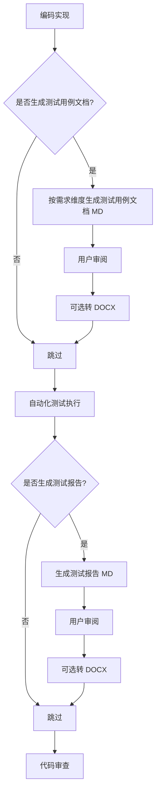

# 测试用例文档 + 测试报告文档 沉淀能力

> 日期: 2026-05-18
> 状态: 已批准

## 背景

harness-testing 当前只输出数字摘要（通过/失败/覆盖率），无法沉淀可评审的测试用例文档和测试报告文档。测试用例评审需要结构化、可读的文档支撑。

## 需求

1. 新增测试用例文档模板（按需求/功能维度组织）
2. 新增测试报告文档模板
3. 编码完成后增加决策点：是否生成测试用例文档
4. 自动化测试完成后增加决策点：是否生成测试报告
5. 所有路径引用适配三层覆盖规则（`.harness/` > `harness.local/` > `harness/`）

## 流程变更



## 涉及变更

| 变更类型 | 文件 | 说明 |
|---------|------|------|
| 新增 | `09-templates/测试用例文档模板.md` | 测试用例文档模板 |
| 新增 | `09-templates/测试报告文档模板.md` | 测试报告文档模板 |
| 修改 | `02-skills-source/harness-implementation/SKILL.md` | 完工标准增加决策点 |
| 修改 | `02-skills-source/harness-testing/SKILL.md` | 测试执行后增加决策点 |
| 修改 | `01-rules/02-development-workflow/01-testing-standards.md` | 补充测试文档规范 |

## 路径规则

所有模板引用遵循三层覆盖，不写死路径：

```
1. <project>/.harness/09-templates/测试用例文档模板.md    ← 项目覆盖
2. ~/.claude/harness.local/09-templates/测试用例文档模板.md ← 公司覆盖
3. ~/.claude/harness/09-templates/测试用例文档模板.md      ← 默认兜底
```
