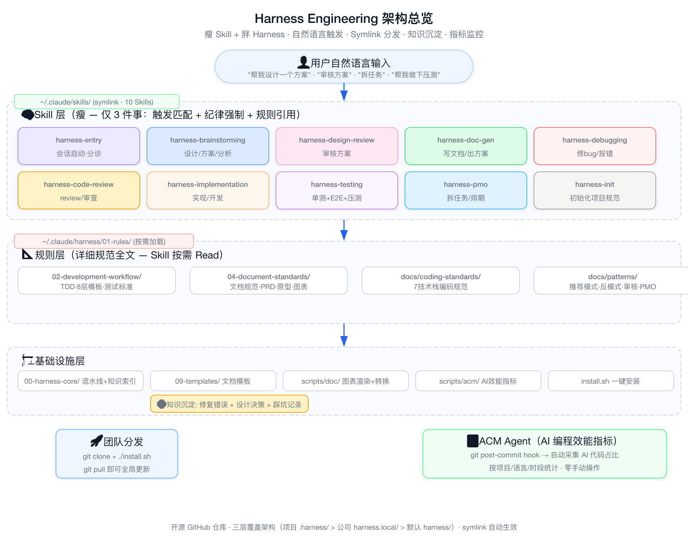
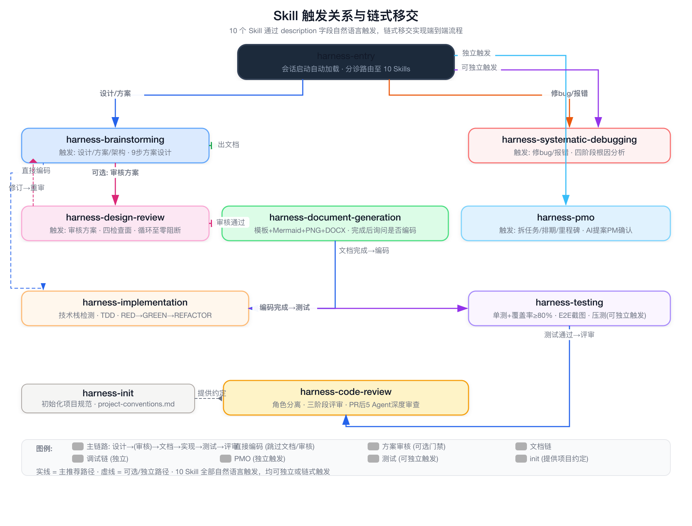
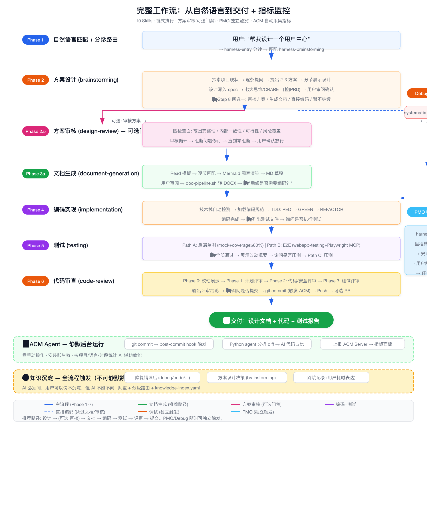

# Harness Engineering 培训指导文档

> **版本**: v2.1.0
> **日期**: 2026-06-14
> **受众**: 研发中心全体成员
> **前置要求**: 已安装 Claude Code，了解基本对话操作

---

## 目录

1. [项目概述](#1-项目概述)
2. [背景与动机](#2-背景与动机)
3. [核心原理](#3-核心原理)
   - 3.5 [Harness Engineering 本质上是 Closed Loop Engineering](#35-harness-engineering-本质上是-closed-loop-engineering)
4. [安装与更新](#4-安装与更新)
5. [配置分层与覆盖](#5-配置分层与覆盖)
6. [能力全景](#6-能力全景)
7. [项目实操指引](#7-项目实操指引)
8. [自动化测试](#8-自动化测试)
9. [与 Superpowers 的关系](#9-与-superpowers-的关系)
10. [常见问题](#10-常见问题)
11. [附录](#11-附录)

---

## 1. 项目概述

### 1.1 Harness Engineering 是什么

Harness Engineering 是一套**开源 AI Agent 工程纪律体系**，通过纯文本 Markdown 技能文件（SKILL.md）为 Claude Code 注入工程纪律。从架构范式上看，它是 **Closed Loop Engineering（封闭循环工程）** 的完整实现——预设端到端路径，每个阶段有明确的完成标准和退出条件，通过链式移交形成可接续的工程流水线。

核心口号：**AI 编程缺的不是智力，是纪律，而纪律可以用纯文本分发。**

**v2.1 新特性**：融合 Loop Engineering 理论体系，完善知识库加载策略，强化方案审核链式移交。

### 1.2 解决什么问题

当你和 Claude Code 协作时，是否遇到这些情况：

- 让它帮你加一个功能，代码写出来了，但里面混入了它自己"发明"的需求
- 让它修一个 bug，它说"可能是这里"，改了没好，又说"那可能是那里"，反复横跳
- 让它写个方案文档，章节结构对不上模板，漏了关键字段
- 长会话中，Claude 逐渐"忘记"该走的流程，开始跳过测试、直接猜 bug
- 写完代码后不知道测试写得对不对，覆盖率够不够
- 端到端页面测试需要手动点点点

**Harness Engineering 解决的就是这些问题。** 不是给 Claude 加能力，而是给 Claude 加纪律。

### 1.3 核心特色

| 特性 | 说明 |
|------|------|
| **自然语言触发** | 无需记忆 `/` 命令，说"帮我写个方案"即可自动触发完整文档流程 |
| **HARD GATE 强制执行** | 关键步骤不可跳过——没经过设计审批，一行代码都不许写 |
| **链式移交** | 多个 skill 自动衔接：brainstorming → design-review → implementation → testing → code-review / PMO 可独立触发 |
| **一键安装** | `git clone + ./install.sh` 两分钟完成部署 |
| **团队自动同步** | `git pull` 即可更新所有 skill（基于 symlink 架构） |

### 1.4 架构总览



---

## 2. 背景与动机

### 2.1 AI Agent 协作的"纪律鸿沟"

Claude Code 本身具有强大的代码生成、分析和调试能力，但存在一个根本性问题：

> Claude 知道该写测试，但在"快速给我跑一遍看看"的语境下，它会跳过。
> Claude 知道 debug 要找根因，但你说"快帮我改一下"，它就直接猜着改了。

这不是能力问题，是**语境驱动下的纪律缺失**。人类工程师有代码审查、测试覆盖、设计评审等流程约束，AI Agent 默认没有。

### 2.2 Superpowers 的启示

[Superpowers](https://github.com/anthropics/superpowers) 是一个 GitHub 上 185,000+ stars 的 Claude Code 插件，其核心设计哲学是：

- 每一个 skill 本质上是一个 Markdown 文件
- 文件内容不是代码，不是工具调用，就是**纯文本的行为约束**
- 用 `<HARD-GATE>` 强制执行工程师该有的纪律
- 不管用户怎么催，都不会绕过应走的流程

文章《185000 星的 Superpowers 插件，90% 的人只用了它 10% 的功能》详细拆解了这套系统的核心价值和执行流程。Harness Engineering 正是基于这一设计哲学，结合企业级全流程需求（文档生成、模板遵循、评审轮次、部署门禁）构建的。

### 2.3 从个人到团队的诉求

Superpowers 解决了个体 AI 协作的纪律问题，但团队场景需要更多：

| 需求 | Superpowers | Harness Engineering |
|------|------------|-------------------|
| 自然语言触发 | 英文描述 | 中英双语触发词 |
| 文档生成流程 | 无 | 模板遵循 + 图表 + md→docx |
| 团队分发 | 个人安装 | 一键安装 + git pull 同步 |
| 定制能力 | writing-skills | writing-skills + 模板扩展 |

---

## 3. 核心原理

### 3.1 瘦 Skill + 胖 Harness 架构

Harness Engineering 的核心架构设计：**Skill 文件只做三件事——触发匹配、纪律强制、规则引用。详细规则留在 Harness 目录中按需加载。**

```
~/.claude/
├── skills/                              ← Claude Code 自动扫描
│   ├── harness-entry/ → (symlink)
│   ├── harness-brainstorming/ → (symlink)
│   ├── harness-design-review/ → (symlink)
│   ├── harness-document-generation/ → (symlink)
│   ├── harness-systematic-debugging/ → (symlink)
│   ├── harness-code-review/ → (symlink)
│   ├── harness-init/ → (symlink)
│   ├── harness-implementation/ → (symlink)
│   ├── harness-pmo/ → (symlink)
│   └── harness-testing/ → (symlink)
│   └── harness-design-indexer/ → (symlink)   ← v2.0 新增
│
├── harness/                              ← Layer 1: GitHub 仓库（默认）
│   ├── CLAUDE.md
│   ├── install.sh
│   ├── 00-harness-core/                  ← 中枢流水线 + 知识索引
│   │   ├── 00-application-owner-agent.md
│   │   └── knowledge-index.yaml          ← 错误沉淀知识索引
│   ├── 01-rules/                         ← 详细规则（Skill 按需 Read）
│   ├── 02-skills-source/                 ← Skill 源文件（11 个）
│   ├── 09-templates/                     ← 文档模板
│   ├── scripts/                          ← 工具脚本
│   └── docs/                             ← 项目文档 + 知识库
│
└── harness.local/                        ← Layer 2: 公司/组织覆盖
    ├── 09-templates/                     ← 公司自定义模板
    ├── docs/                             ← 公司业务知识库
    ├── 01-rules/                         ← 覆盖/补充编码规范
    └── scripts/                          ← 覆盖/补充工具脚本

<project>/.harness/                       ← Layer 3: 项目覆盖（最高优先级）
    ├── 09-templates/                     ← 项目专属模板
    └── docs/                             ← 项目专属知识库
```

**精妙之处**：`install.sh` 将 `~/.claude/skills/harness-*` 做成指向 `~/.claude/harness/02-skills-source/` 的 symlink。这样 `git pull` 即可更新所有 Skill。

### 3.2 自然语言触发机制

每个 Skill 的 YAML 前置元数据中包含 `description` 字段，这是自然语言触发器的核心：

```yaml
---
name: harness-document-generation
description: Use when user asks to 生成文档, 写方案, 出文档, 写设计文档, 写PRD,
  写接口文档, 写物理模型, 产出文档, generate document, write proposal, create doc
  — ensures brainstorming → template compliance → diagrams → md draft → user review
  → docx pipeline.
---
```

Claude 在收到每条消息时，会扫描所有已注册 Skill 的 `description` 字段，匹配后自动 invoke 对应 Skill。用户完全不需要知道技能名称。

**效果：**

| 用户说 | Claude 自动做 |
|--------|-------------|
| "帮我设计一个用户中心" | → 走 brainstorming 全流程 |
| "审核方案 / 帮我看下方案有没有问题" | → 走 design-review 四检查面审核循环 |
| "帮我写个技术方案文档" | → 读模板 → 逐节生成 → 配图 → md转docx |
| "这个接口报 500 了帮我看看" | → 系统调试四阶段 → 找根因 → 修复 |
| "帮我 review 这段代码" | → 独立评审 → 17 维度规范检查 → 存量一致性 |
| "帮我实现这个功能" | → TDD → 编码规范 → 项目约定复用 |
| "帮我写测试 / 帮我测一下" | → 单测 + 覆盖率 + E2E + 压测（按需） |
| "拆任务 / 排期 / 里程碑" | → PMO 逐层拆解（里程碑→史诗→用户故事→任务） |
| "初始化项目规范 / harness-init" | → 扫描存量工程 → 生成 project-conventions.md |

### 3.3 HARD GATE 强制执行

每个 Skill 包含 `<HARD-GATE>` 标签定义不可绕过的约束。这是**程序化规则**，不是"建议"。

harness-brainstorming 的 HARD GATE 示例：

```markdown
<HARD-GATE>
Do NOT invoke any implementation skill, write any code, scaffold any project,
or take any implementation action until:
1. Brainstorming is complete
2. Design spec is written and committed
3. User has approved the spec
This applies to EVERY task regardless of perceived simplicity.
</HARD-GATE>
```

harness-document-generation 的 HARD GATE 示例：

```markdown
<HARD-GATE>
生成任何文档前必须：
1. 触发 brainstorming → 用户确认方案
2. Read 对应模板 → 逐节匹配
3. 生成 MD 草稿 → 用户审阅
4. 图表嵌入 + 所有 .md 转 .docx
跳过任意一步 = 违规。
</HARD-GATE>
```

### 3.4 链式移交

Skill 之间通过明确的"移交规则"实现端到端流程链路：



**两条主要链路：**

1. **开发链路**：harness-entry → harness-brainstorming → (可选: harness-design-review → 审核通过后路径A回brainstorming Step 8 / 路径B链式移交) → harness-implementation（TDD+测试文件告知） → harness-testing（单测+覆盖率+压测询问） → harness-code-review（改动展示+三阶段评审） → finishing（审查通过→询问提交→PR→code-review插件深度审查）
2. **文档链路**：harness-entry → harness-brainstorming → harness-document-generation

**两条独立链路：**

3. **审核链路**：harness-entry → harness-design-review（独立触发："审核方案"）→ 审核通过后链式移交询问（生成文档/直接编码/暂不继续）
4. **PMO链路**：harness-entry → harness-pmo（独立触发："拆任务/排期/里程碑"）

**三条应急链路：**

5. **调试链路**：harness-entry → harness-systematic-debugging（独立执行）
6. **测试链路**：harness-testing ← 可独立触发（"帮我做下压测"直接进入压测配置），也可从 implementation 移交
7. **评审链路**：harness-code-review ← 可独立触发，也可从 testing 移交

**初始化链路：**

8. **初始化链路**：harness-init → 扫描存量工程 → 生成 project-conventions.md → 后续 implementation / code-review 自动加载

### 3.5 Harness Engineering 本质上是 Closed Loop Engineering

2026 年5月，AI 编程社区从 Harness Engineering 的基础上演进出了 **Loop Engineering（循环工程）** 范式。而我的Harness Engineering 在架构层面已经完整融合了 Loop Engineering 的全部构件，属于 Closed Loop Engineering（封闭循环工程）的典型实现。

#### 3.5.1 Loop Engineering 的五大构件在 Harness 中的映射

Loop Engineering 将 Agent 循环系统拆解为五个构件加一个记忆层。Claude Code 和 Codex 等主流平台已原生支持全部五个构件，而 Harness 在此基础上为每个构件赋予了工程纪律：

| # | 构件 | 作用 | Harness 中的实现 |
|---|------|------|-----------------|
| 1 | **Skills（技能资产）** | 停止每次从零解释项目，让循环产生复利 | 11 个 SKILL.md 文件 + `docs/` 知识库体系 + 三层覆盖架构。每次做过的难题沉淀为 Skill 或知识条目，下次自动加载，不再重复消耗 Token。 |
| 2 | **Sub-agents（Maker≠Checker）** | 写代码的和验证的分开，防止自评自满 | `harness-design-review` 独立于 `harness-brainstorming` 审核方案；`harness-code-review` 独立于 `harness-implementation` 审查代码。同一模型的不同角色指令，实现蓝皮书推荐的 Maker-Checker 分离。 |
| 3 | **Memory（记忆层）** | 存在对话之外的东西，模型会遗忘但仓库不会 | `pipeline-state.json` 跨会话追踪流水线状态；`knowledge-index.yaml` 索引所有沉淀教训；`04-changes/` 目录持久化每个变更的全流程产物（spec → review → plan）。 |
| 4 | **Plugins/Connectors（连接器）** | Agent 能操作真实工具链 | 通过 MCP 协议接入 GitHub、Playwright、Figma 等外部工具，所有 Skill 可调用标准工具链。 |
| 5 | **Worktrees（工作树隔离）** | 并行 Agent 互不踩踏文件 | `using-git-worktrees` skill 确保并行任务在独立 git worktree 中执行，物理隔离文件修改。 |
| 6 | **Automations（心跳/定时触发）** | 让 loop 从一次性运行变成真正的循环 | Harness 当前以会话驱动为主，链式移交中的用户确认环节承担了"循环触发"的角色——每个阶段的完成标准达标后，自动询问是否进入下一阶段。 |

#### 3.5.2 Closed Loop vs Open Loop：Harness 为什么选择封闭循环

Loop Engineering 分为两类：

| | Closed Loop（封闭循环） | Open Loop（开放循环） |
|------|------|------|
| **结构** | 人类预先设计端到端路径 | Agent 自主探索，路径不预设 |
| **Agent 自由度** | 在预设框架内循环 | 可尝试不同路径，发现未预设方案 |
| **成本** | 预算可控 | Token 消耗极大 |
| **风险** | 每步有质量门禁 | 松散标准下容易变成"slop machine" |
| **适用场景** | **90% 的生产工作** | 前沿探索、无限预算的实验 |

而我的Harness Engineering 选择 Closed Loop，是从企业级工程质量出发的刻意设计：

- **预设端到端路径**：`harness-entry → brainstorming → design-review → implementation → testing → code-review → closed`，每一步都有明确的进入条件和退出标准。
- **每个阶段有量化完成标准**：brainstorming 要求用户审阅通过，implementation 要求覆盖率 statement ≥80%、branch ≥70%，design-review 要求本轮零阻断问题，code-review 要求审查结论 APPROVED。
- **Maker ≠ Checker**：方案审核和代码审查都是独立角色，防止"自己给自己打分永远满分"的认知偏差。
- **知识积累复利**：每次修复错误、设计决策、踩坑经验，通过沉淀评估 → 判重 → 写入 → 更新索引，下次 brainstorming/implementation 的 Step 0 自动加载。这不是一次性流程，而是一个不断自增强的知识循环。

#### 3.5.3 链式移交给用户确认，是缺陷还是设计？

Loop Engineering 社区有一个核心争论：**循环应该全自动闭合（失败 → 自动修复 → 重试），还是需要人类确认？**

我认为：

> "Loop 不替代你，它放大你。无人值守的 Loop 也是无人值守地犯错。'Done'是声明不是证明。"
> "当 Loop 自己跑得顺时，极其诱人的姿态是停止有主见、接受一切产出——这叫 Cognitive Surrender（认知投降）。"

而我的Harness 的链式移交在关键决策点保留用户确认，**不是自动化能力的缺失，而是企业级工程协作的刻意设计**：

| 确认点 | 确认内容 | 为什么需要人在回路 |
|--------|---------|-------------------|
| brainstorming → 下一步 | 审核方案/生成文档/直接编码 | spec 是否正确，只有设计者能判断 |
| implementation → 下一步 | 是否执行测试/是否审查代码 | 编码是否达到预期，需要开发者确认 |
| testing → 下一步 | 失败后的处理方向 | 回归 implementation 还是暂停讨论架构 |
| code-review → 下一步 | 审查结论的处理 | APPROVED/CHANGES_REQUESTED/REJECTED 需要人决策 |
| design-review → 下一步 | 通过/修订/驳回 | 阻断问题是否真正解决，需要设计者判断 |

**这个设计使 Harness 成为"Inside-the-Loop"架构**——计划可见、高风险操作有 approval gate、中间状态可介入。蓝皮书明确指出这是生产系统的最佳实践："最简 inside-the-loop = 计划审查门 + diff 提交前门。"

#### 3.5.4 知识沉淀：最完整的反馈闭环

Loop Engineering 的核心公式是 `Loop = Cron + Decision-maker + Feedback + Guardrails`。其中 Feedback（反馈闭合）是最容易被忽视的一环。

而我的Harness 的知识沉淀机制是完整的反馈闭环：

```
修复错误/设计决策/踩坑
    ↓
AI 输出沉淀判断（不可跳过）
    ↓
用户确认
    ↓
查 knowledge-index.yaml 判重
    ├─ 同类存在 → 合并更新
    └─ 新类 → 新建条目
    ↓
写入知识库文件 + 更新索引
    ↓
下次 brainstorming/implementation Step 0 自动加载
    ↓
避免同类问题再次出现
```

这与Loop Engineering中 Amit Shekhar 的五步法完全对应：

| 五步法 | Harness 中的实现 |
|--------|-----------------|
| Step 1: 定义"Done" | 每个 Skill 的 HARD-GATE 完成标准（覆盖率 ≥80%、零阻断问题等） |
| Step 2: 构建 Context | 知识加载阶段自动组装（技术栈检测 + 按场景加载规范 + 按需加载设计章节） |
| Step 3: 执行并捕获一切 | pipeline-state.json 记录每个阶段的产出和状态 |
| Step 4: 用反馈闭合循环 | 知识沉淀 → 下次自动加载；测试失败 → 回 implementation 修复 |
| Step 5: 设置护栏 | HARD-GATE 强制执行 + 三次失败规则 + 链式移交不可跳过 + Token/深度控制 |

**一个人的工作从"打字"上移到"设计循环系统"。** 蓝皮书引用 Claude Code 创造者 Boris Cherny 的话——"My job is to write loops"——这正是 Harness Engineering 为用户提供的价值：你不再是在循环里一轮轮手打 prompt 的人，你是设计这个循环系统的人。

---


## 4. 安装与更新

### 4.1 前置条件

- macOS / Linux（含 Windows WSL2）环境
- 已安装 [Claude Code](https://claude.ai/code) CLI
- 已安装 Git
- pandoc — 用于 md2docx.sh 文档转换（必装）
- mmdc（@mermaid-js/mermaid-cli）— 用于 Mermaid 图表渲染（必装）
- rsvg-convert（librsvg）— 用于 SVG→PNG 转换（必装）
- Python 3 — 用于图表提取和代码块替换脚本（必装）

### 4.2 一键安装

```bash
# 克隆仓库到 ~/.claude/harness/
git clone https://github.com/<org>/harness-engineering.git ~/.claude/harness

# 进入目录并执行安装
cd ~/.claude/harness && ./install.sh
```

**install.sh 做了什么：**

1. 依赖检查（git、Node.js、pandoc、mmdc、rsvg-convert、Python 3 等）
2. 将 `02-skills-source/` 中的 11 个 Skill 通过 **symlink** 注册到 `~/.claude/skills/`
3. 将 `CLAUDE.md` symlink 到 `~/.claude/CLAUDE.md`
4. 创建公司级覆盖目录 `~/.claude/harness.local/`（含 09-templates/、docs/、01-rules/、scripts/）
5. 验证安装完整性（Skill 数量、模板、脚本、知识索引）

**安装输出示例：**

```
╔══════════════════════════════════════════╗
║   Harness Engineering — 安装中...         ║
╚══════════════════════════════════════════╝

🔍 检查依赖...
   [必装] 核心工具链
   ✅ git: git version 2.x.x
   ✅ Node.js: v22.x.x
   ✅ npx: 10.x.x
   ✅ pandoc: pandoc 3.x
   ✅ rsvg-convert: rsvg-convert version 2.x
   ✅ Python 3: Python 3.x.x

   [必装] npm 全局包
   ✅ Claude Code CLI: 1.x.x
   ✅ mermaid-cli (mmdc): 11.x.x

📦 注册自然语言触发 skills...
   ✅ harness-brainstorming
   ✅ harness-code-review
   ✅ harness-design-indexer
   ✅ harness-design-review
   ✅ harness-document-generation
   ✅ harness-entry
   ✅ harness-init
   ✅ harness-implementation
   ✅ harness-pmo
   ✅ harness-systematic-debugging
   ✅ harness-testing

📋 安装全局 CLAUDE.md...
   ✅ CLAUDE.md

📁 创建公司级覆盖目录...
   ✅ ~/.claude/harness.local/09-templates/
   ✅ ~/.claude/harness.local/docs/
   ✅ ~/.claude/harness.local/01-rules/
   ✅ ~/.claude/harness.local/scripts/

🔍 验证安装...
   Harness skills 注册: 11 个
   ✅ CLAUDE.md
   ✅ Harness 目录
   ✅ 文档模板
   ✅ 工具脚本（doc-pipeline + render-diagrams 等）
   ✅ 知识索引

╔══════════════════════════════════════════╗
║  ✅ Harness Engineering 安装完成         ║
║                                           ║
║  现在你可以用自然语言触发所有能力：          ║
║  • "帮我设计..." → brainstorming          ║
║  • "审核方案..." → design-review          ║
║  • "帮我写方案..." → 文档生成全流程         ║
║  • "帮我修bug..." → 系统调试               ║
║  • "帮我review..." → 代码审查              ║
║  • "帮我实现..." → TDD + 编码规范          ║
║  • "拆任务/排期..." → 项目管理(PMO)        ║
║  • "帮我写测试..." → 单测 + E2E             ║
║  • "帮我做下压测..." → 压力测试+性能报告    ║
║  • "初始化项目规范..." → harness-init       ║
║                                           ║
║  更新: cd ~/.claude/harness && git pull    ║
║  定制: ~/.claude/harness.local/ 覆盖模板/知识库 ║
║  卸载: rm ~/.claude/skills/harness-*       ║
╚══════════════════════════════════════════╝
```

### 4.3 更新流程

Harness Engineering 通过 **symlink** 架构实现零摩擦更新：

```bash
cd ~/.claude/harness && git pull
```

因为 `~/.claude/skills/harness-*` 是 symlink 指向 `~/.claude/harness/02-skills-source/`，`git pull` 更新源文件后，所有 Skill 自动生效。

**无需重新运行 install.sh**（除非新增了 Skill 需要创建新的 symlink）。

### 4.4 卸载

```bash
# 删除 Skill symlink
rm -rf ~/.claude/skills/harness-*

# 恢复原始 CLAUDE.md（如需要）
# 备份文件在 ~/.claude/CLAUDE.md.bak.*

# 删除仓库（可选）
rm -rf ~/.claude/harness
```

---

## 5. 配置分层与覆盖

### 5.1 三层架构

Harness Engineering 采用**三层覆盖架构**，让不同级别的定制互不干扰：

```
┌─────────────────────────────────────────────────┐
│  Layer 3: 项目覆盖 (最高优先级)                    │
│  <project>/.harness/09-templates/                │
│  <project>/.harness/docs/                        │
├─────────────────────────────────────────────────┤
│  Layer 2: 公司/组织覆盖                           │
│  ~/.claude/harness.local/09-templates/           │
│  ~/.claude/harness.local/docs/                   │
├─────────────────────────────────────────────────┤
│  Layer 1: Harness 默认 (最低优先级)               │
│  ~/.claude/harness/09-templates/                 │
│  ~/.claude/harness/docs/                         │
└─────────────────────────────────────────────────┘
```

### 5.2 路径解析规则

当 Skill 需要查找模板、规则、脚本或知识库时，按以下优先级依次查找，**找到即停**：

```
1. <project>/.harness/        ← 项目覆盖（最高优先级）
2. ~/.claude/harness.local/   ← 公司/组织覆盖
3. ~/.claude/harness/         ← Harness 默认（兜底）
```

**替换语义**（模板、规则、脚本）：同名文件高优先级覆盖低优先级。

```
查找 PRD标准模板_v2.0.md:
1. <project>/.harness/09-templates/PRD标准模板_v2.0.md  ← 有则用
2. ~/.claude/harness.local/09-templates/PRD标准模板_v2.0.md  ← 有则用
3. ~/.claude/harness/09-templates/PRD标准模板_v2.0.md  ← 兜底
```

**叠加语义**（知识库 docs）：三层都在搜索路径中，按优先级查找。

### 5.3 公司/组织定制

当其他公司或团队使用 Harness 时，可以将自定义模板和知识库放入 `~/.claude/harness.local/`，无需修改 Harness 源码：

```bash
# install.sh 已自动创建此目录
~/.claude/harness.local/
├── 09-templates/
│   ├── PRD标准模板_v2.0.md        # 替换 Harness 默认 PRD 模板
│   └── 接口设计规范.md             # 新增公司特有模板
├── docs/
│   ├── architecture/              # 覆盖项目工程约定
│   │   └── project-conventions.md # 公司级工程约定
│   ├── 业务领域知识.md              # 公司业务知识库
│   └── 编码规范补充.md              # 补充 Harness 默认规则
```

**推荐**：将 `harness.local/` 作为独立 git 仓库管理，公司内部共享。

**优势**：Harness 上游更新时 `git pull` 不冲突，公司定制隔离在 `harness.local/`。

### 5.4 项目级定制

特定项目有专属模板或知识库时，在项目根目录创建 `.harness/` 目录：

```bash
your-project/
├── .harness/
│   ├── 09-templates/
│   │   └── 系统设计文档模板.md      # 覆盖全局模板（仅此项目用）
│   ├── docs/
│   │   ├── architecture/
│   │   │   └── project-conventions.md  # 项目工程约定（/harness-init 生成）
│   │   └── 项目业务上下文.md         # 项目专属知识库
├── src/
└── ...
```

项目 `.harness/` 优先级最高，同名文件直接覆盖全局和公司层。

### 5.5 覆盖范围一览

| 可覆盖内容 | 相对路径 | 覆盖语义 | 通常覆盖场景 |
|-----------|---------|---------|------------|
| 核心流水线 | `00-harness-core/` | 同名文件覆盖 | 极少覆盖 |
| 详细规则 | `01-rules/` | 同名文件覆盖 | 公司/项目补充规范 |
| 文档模板 | `09-templates/` | 同名文件覆盖 | 公司/项目定制模板 |
| 工具脚本 | `scripts/` | 同名文件覆盖 | 公司/项目定制脚本 |
| 知识库 | `docs/` | 三层叠加，按优先级查找 | 公司/项目业务知识 |
| 变更记录 | `04-changes/` | 项目级独立 | 不覆盖 |

---

## 6. 能力全景

### 6.1 11 个 Skill 一览

| Skill | 自然语言触发词 | 核心能力 | 移交目标 |
|-------|-------------|---------|---------|
| **harness-entry** | 会话启动自动加载 | 建立纪律基线，声明所有能力 | — （常驻） |
| **harness-brainstorming** | 设计 · 方案 · 分析需求 · 架构 · 选型 | 9步方案设计，产出 committed spec | design-review / implementation / document-generation |
| **harness-design-review** | 审核方案 · review设计 · 方案评审 | 独立方案审核，四检查面循环直到零阻断问题，审核通过后链式移交（生成文档/直接编码） | brainstorming（修订）/ document-generation / implementation |
| **harness-document-generation** | 写文档 · 出方案 · 生成 PRD · 写设计文档 | 模板遵循 + 配图 + md 转 docx | — （交付完成） |
| **harness-systematic-debugging** | 修 bug · 调试 · 报错 · 不工作 · 异常 | 四阶段系统调试，三次失败规则 | — （修复完成或架构讨论） |
| **harness-code-review** | review · 审查 · 检查代码 · 审计 | 三阶段独立评审，规范/安全/项目约定一致性检查 | — （评审结论） |
| **harness-init** | 初始化项目规范 · 生成项目约定 · harness-init | 扫描存量工程，生成 project-conventions.md | implementation / code-review |
| **harness-implementation** | 实现 · 开发 · 写代码 · 编码 | TDD + 编码规范 + 项目约定复用 | testing / code-review |
| **harness-testing** | 写测试 · 跑测试 · 单测 · E2E · 测覆盖率 · **压测 · 性能测试** | 后端单测 (mock+coverage≥80%) + E2E (webapp-testing+Playwright MCP) + **压测 (可交互配置+动态报告)** | code-review（通过）/ implementation（失败） |
| **harness-pmo** | 拆任务 · 排期 · 里程碑 · 用户故事 · 需求拆解 | 里程碑→史诗→用户故事(P0/P1/P2)→任务逐层拆解 | — （产出项目规划总表） |
| **harness-design-indexer** | 自动调用（不直接触发） | 设计文档智能索引，按需加载章节，节省上下文 | — （内部支持 skill） |

### 6.2 完整工作流



### 6.3 知识沉淀与知识索引

Harness Engineering 的**知识沉淀**机制是 CLAUDE.md 核心纪律第 8 条，覆盖**全流程**——不仅限于修复错误，确保从各类工程活动中系统化学习，避免同类问题反复出现。

#### 6.3.1 触发场景

知识沉淀在以下三类场景中触发，AI 必须主动评估是否值得沉淀：

| 场景 | 触发时机 | 示例 |
|------|---------|------|
| **a) 修复错误后** | debug / implementation / testing / code-review / document-generation / brainstorming 中发现并修复问题后 | Bug 根因修复、评审发现安全漏洞、文档生成发现模板违规 |
| **b) 方案设计决策** | brainstorming 结束时有非显而易见的架构取舍或设计决策 | "虽然方案 A 是常规选择，但这里选了方案 B 因为..." |
| **c) 踩坑记录** | 用户显式表达耗时过长或踩坑（如"这个坑花了我半天""这次搞太久了"） | 环境配置陷阱、框架版本兼容问题、非代码层面的经验教训 |

设计决策沉淀写入 `docs/patterns/recommended.md`，反模式写入 `docs/patterns/anti-patterns.md`。

#### 6.3.2 工作机制

知识沉淀采用**硬门禁**设计——评估步骤本身不可跳过，与测试门禁同构：AI 必须问，用户可以说不沉淀，但 AI 不能不问。

```
触发沉淀场景
    ↓
【必须执行】AI 输出沉淀判断（不可静默跳过评估步骤）
    ├─ 值得沉淀：[类型|严重度|摘要] → 向用户展示，请确认
    └─ 无需沉淀：[原因] → 向用户展示，请确认（用户可 override 强制沉淀）
    ↓
用户确认沉淀
    ↓
查 00-harness-core/knowledge-index.yaml 判重
    ├─ 同类存在 → 合并更新
    └─ 新类 → 新建条目
    ↓
写入文件 + 更新索引
```

**沉淀路径按 type × severity 分级：**

| 类型 | 严重度 | 沉淀位置 |
|------|--------|---------|
| process | high | SKILL.md 中的 `<HARD-GATE>` |
| rule | high/medium | `01-rules/` 目录 |
| anti-pattern | high/medium | `docs/patterns/anti-patterns.md` |
| knowledge | medium/low | `docs/` 知识库 |
| design-decision | any | `docs/patterns/recommended.md` |

#### 6.3.3 knowledge-index.yaml

`00-harness-core/knowledge-index.yaml` 是知识沉淀的**知识索引**文件，**按需加载**——仅在用户确认沉淀教训时读取，不在 harness-entry 启动时加载，避免浪费 token。

**索引条目结构：**

```yaml
- id: ks-001
  title: "文档图表渲染必须用标准脚本"
  type: process
  severity: high
  tags: [document, diagram, script, automation]
  location: scripts/doc/doc-pipeline.sh
  summary: "文档图表渲染+替换+转DOCX必须用标准脚本，禁止手动逐个替换"
```

**判重规则**：新条目与已有条目 `tags` 重叠 > 50% 视为同类，合并而非新建。

**三层覆盖**：项目 `.harness/00-harness-core/knowledge-index.yaml` > 公司 `harness.local/` > Harness 默认，与模板/规则覆盖规则一致。

### 6.4 ACM Agent — AI 编程效能指标采集（v1.6.0 新增）

Harness Engineering 内置了 **ACM Agent**（AI Coding Metrics），在 git commit 时自动采集 AI 辅助编程的效能指标，无需手动操作。

#### 6.4.1 采集什么

| 指标 | 说明 |
|------|------|
| **AI 代码占比** | 本次 commit 中 AI 生成代码的行数比例 |
| **commit 频率** | 按时间段统计 commit 次数 |
| **语言分布** | 按编程语言统计 AI 辅助的代码量 |
| **项目维度** | 按项目/仓库统计 AI 使用情况 |

#### 6.4.2 工作原理

```
git commit
    ↓
post-commit hook 触发
    ↓
ACM Python agent 分析 diff → 计算 AI 代码占比
    ↓
数据写入 ~/.acm/pending/
    ↓
定期上报到 ACM 服务端（可配置地址）
```

ACM Agent 通过 git `post-commit` hook 自动运行，安装后**零手动操作**。支持以下安装模式：

- **新仓库**：通过 `git config --global init.templateDir` 自动注入 hook
- **已有仓库**：通过 `core.hooksPath` 或注入到现有 hook 文件中

#### 6.4.3 配置

ACM 服务端地址在 `~/.acm/config` 中配置：

```bash
# 安装时可自定义，默认 http://localhost:8080
ACM_SERVER_URL=http://your-acm-server:8080
```

ACM Agent 随 `install.sh` 自动安装，详见[第 4 章：安装与更新](#4-安装与更新)。

### 6.5 多技术栈编码规范

Harness Engineering 内置了 **7 个技术栈**的编码规范，覆盖前后端和移动端，每个栈覆盖分层/安全/数据库/并发/事务/日志/测试等维度：

| 技术栈 | 检测信号 | 栈内规范 | 共享规范 |
|--------|---------|:-----:|:-----:|
| Java/Spring | `pom.xml` / `build.gradle` | 10 文件 | ✅ |
| Python | `pyproject.toml` / `requirements.txt` | 10 文件 | ✅ |
| Go | `go.mod` | 9 文件 | ✅ |
| TypeScript/React | `package.json` + `tsconfig.json` | 10 文件 | ✅ |
| .NET/C# | `.csproj` / `.sln` | 10 文件 | ✅ |
| Android/Kotlin | `build.gradle.kts` + `AndroidManifest.xml` | 9 文件 | — |
| iOS/Swift | `*.xcodeproj` / `*.xcworkspace` | 10 文件 | — |

实现功能时，`harness-implementation` 自动检测项目技术栈，从栈 `00-index.md` 速查表查找并加载对应规范。后端项目额外加载 4 个编程语言无关的通用规范：REST API 设计、配置管理、缓存策略、幂等性设计。

### 6.6 多角色入口路由

不同角色可从不同阶段进入流水线，上游产出物自动衔接：

| 角色 | 入口 | 前置条件 | 实际链路 |
|------|------|---------|---------|
| PM/产品经理 | 写文档 | 需求成型 | brainstorming → PRD → 交付 |
| 架构师/Tech Lead | 开发功能 | PM 已交付 PRD | PRD → 系统方案 → 移交开发 |
| 前端/后端开发 | 开发功能 | spec/PRD 已 approved | TDD 编码 → testing |
| 测试工程师 | 写测试 | 代码已提交 | 补充用例 → E2E → 压测 |
| Reviewer | 做审查 | 代码+测试完成 | 独立评审 → 提交 |

每个阶段完成后写入 `pipeline-state.json`，下游角色通过读取该文件自动确定接续点，**不重复执行已完成步骤**。

---

## 7. 项目实操指引

### 7.1 场景一：开发一个新功能

**用户说**："帮我设计一个用户积分系统"

**系统自动执行：**

1. **harness-entry 加载** → 建立纪律基线
2. **description 匹配** → "设计"触发 harness-brainstorming
3. **Brainstorming 9 步流程：**
   - 探索项目现状（读文件、commits）
   - 逐条问澄清问题（积分规则？兑换比例？过期策略？）
   - 提出 2-3 个方案（数据库方案 vs 缓存方案 vs 混合方案）
   - 分节展示设计（架构、数据模型、API、错误处理）
   - 设计写入 spec 文件并 commit
   - ➡️ Spec 自检 → 用户审阅 → 确认
4. **移交 harness-implementation** → 加载项目工程约定（project-conventions.md）+ 编码规范 → TDD 红绿重构 → Reuse Before Create
5. **编码完成后** → 📢 列出测试文件路径 → 询问是否执行
6. **移交 harness-testing** → 单测+覆盖率 → 压测询问 → 展示改动概要 → 询问是否代码审查
7. **移交 harness-code-review** → Phase 0 改动展示 → 三阶段评审 → 审查通过 → 📢 询问是否提交代码
8. **完工**（提交/PR/保持 三选一）

**全程用户只需：** 说一句话 → 回答问题 → 确认审批。无需知道任何命令。

### 7.2 场景二：写一个方案文档

**用户说**："帮我写一个库存管理系统的接口设计文档"

**系统自动执行：**

1. **harness-entry 加载** → 建立纪律基线
2. **description 匹配** → "写设计文档"触发 harness-document-generation
3. **文档生成流程：**
   - Read `09-templates/系统接口设计文档模版.md`
   - 触发 brainstorming 确认接口范围
   - 逐节按模板生成内容（服务端点、请求参数表、返回码说明、数据字典、范例）
   - 询问图表工具（mermaid / fireworks-tech-graph）
   - 生成 MD 草稿，图表以代码块/PNG 嵌入
4. **用户审阅** → 确认后
5. **批量转换：**
   - `mermaid-render.sh` 提取 .mmd + 渲染 PNG + 替换代码块
   - `md2docx.sh` 生成 .docx 交付
6. **交付完成**

**全程用户只需：** 说一句话 → 选图表工具 → 审阅确认 → 拿到 .docx。

### 7.3 场景三：修复一个 Bug

**用户说**："创建订单的接口返回 500 了，帮我看看"

**系统自动执行：**

1. **harness-entry 加载** → 建立纪律基线
2. **description 匹配** → "报错"触发 harness-systematic-debugging
3. **Phase 1: 根因调查**
   - 完整读取错误日志
   - 稳定复现步骤
   - 检查最近 git 变更
   - 打诊断日志 → 收集证据
4. **Phase 2: 模式分析**
   - 找能跑通的类似代码
   - 逐项对比差异
5. **Phase 3: 单假设验证**
   - 写下具体假设 → 最小变更验证 → 不叠加改动
6. **Phase 4: 实现修复**
   - 先写复现测试 → 只改一处 → 如三次未修复则停，讨论架构
7. **验证修复** → 提交

**全程用户只需：** 说一句话 → 提供复现步骤 → 确认修复。

### 7.4 场景四：做一次代码审查

**用户说**："帮我看一下这段代码"

**系统自动执行：**

1. **harness-entry 加载** → 建立纪律基线
2. **description 匹配** → "审查"触发 harness-code-review
3. **知识加载** → 技术栈检测 → 加载栈规范 + 共享规范 + 项目工程约定
4. **Phase 1: 计划评审** — 检查 spec 是否完整、范围是否明确
5. **Phase 2: 代码评审** — 17 维度对照审查（分层/安全/数据库/并发/事务/日志/REST API/配置/缓存/幂等/测试/存量一致性等）
6. **Phase 3: 测试评审** — 覆盖率、边界条件、全绿通过
7. **输出评审结论** — APPROVED / CHANGES_REQUESTED / REJECTED

### 7.5 场景五：初始化存量项目工程约定

**用户说**："/harness-init" 或 "初始化项目规范"

**系统自动执行：**

1. **harness-entry 加载** → 建立纪律基线
2. **description 匹配** → "初始化项目规范"触发 harness-init
3. **技术栈检测** → 识别项目语言和框架
4. **扫描工程结构** → 返回包装、分页对象、DTO/VO/Entity、异常体系、枚举、常量、工具类、Converter/Mapper、测试风格、典型样例
5. **读取模板** → 按 `docs/architecture/project-conventions.md` 模板章节结构
6. **生成文件** → `<project>/.harness/docs/architecture/project-conventions.md`
7. **输出摘要** → 已识别的核心约定 + 待改善项 + 待人工补充的部分

**全程用户只需：** 说一句话 → 确认项目根目录 → 拿到 project-conventions.md。后续 implementation / code-review 自动加载。

### 7.6 场景六：团队自定义新 Skill

**为团队添加新的 Skill（例如：数据库迁移检查）**

1. 在 `02-skills-source/` 下创建新目录：
   ```bash
   mkdir -p ~/.claude/harness/02-skills-source/harness-db-migration/
   ```

2. 创建 `SKILL.md` 文件，包含：
   ```markdown
   ---
   name: harness-db-migration
   description: Use when user asks to 数据库迁移, 改表结构, 加字段,
     database migration, alter table — ensures backward compatibility
     check and rollback plan.
   ---
   
   # Harness — 数据库迁移检查
   
   <HARD-GATE>
   执行任何数据库变更前必须：
   1. 检查向后兼容性
   2. 生成回滚脚本
   3. 用户确认
   </HARD-GATE>
   
   ## 执行流程
   ...
   ```

3. 重新运行 `install.sh` 注册新 Skill：
   ```bash
   cd ~/.claude/harness && ./install.sh
   ```

4. 团队成员执行 `git pull` 即可自动获取新 Skill。

5. **提 PR 回馈社区**：如果这个 Skill 对其他人也有用，欢迎提 Pull Request。

### 7.8 场景八：方案审核

**用户说**："帮我审核一下方案 / 看看这个设计有没有问题"

**系统自动执行：**

1. **harness-entry 加载** → 建立纪律基线
2. **description 匹配** → "审核方案"触发 harness-design-review
3. **Step 1: 建立审核基线**
   - 读 spec（`00-design.md`）+ 项目架构文档 + 反模式库
4. **Step 2: 四检查面审核**
   - 范围完整性：Scope IN/OUT 明确？Non-goals ≥ 2 项？
   - 内部一致性：不同章节无矛盾？数据流前后对得上？
   - 可行性：在技术栈约束内可实现？关键假设标注验证方式？
   - 风险覆盖：假设失效条件分析过？有缓解措施？
5. **Step 3: 输出审核报告**
   - 问题列表（🔴阻断 / 🟡警告 / 🔵待确认）
   - 写入 `01-design-review.md`
6. **循环修订**：用户确认修订 → brainstorming 改 spec → 回到 Step 1 → 直到无阻断问题
7. **通过后放行**：
   - 由 brainstorming Step 8 触发 → 回到 brainstorming Step 8 重新四选一
   - 独立触发 → 链式移交询问（生成文档/直接编码/暂不继续）

**全程用户只需：** 说一句话 → 审阅审核报告 → 确认修订 → 通过。

### 7.9 场景九：PMO 项目拆解

**用户说**："帮我把这个 spec 拆成任务 / 排个里程碑"

**系统自动执行：**

1. **harness-entry 加载** → 建立纪律基线
2. **description 匹配** → "拆任务"触发 harness-pmo
3. **Step 1: 拆解里程碑（≤ 4 个）**
   - 读 spec + 项目架构 → 输出 M1/M2/M3/M4 时间盒
   - 展示精美表格后等待用户确认
4. **Step 2: 每个里程碑拆史诗（2-4 个/里程碑）**
   - 功能主题分组 → 标注目标+范围+预估
   - 展示后等待用户确认
5. **Step 3: 每个史诗拆用户故事（P0/P1/P2 优先级排序）**
   - As a / I want / So that 格式 + 验收标准
   - 按影响度 × 紧迫度排序
   - 展示后等待用户确认
6. **Step 4: P0 故事拆解为可执行任务**
   - 每个任务半天~1天粒度 → 标注依赖+验收标准+涉及模块
7. **汇总输出**：完整的项目规划总表（里程碑路线图 + 史诗×故事矩阵 + 任务全景 + 统计），写入 `02-project-plan.md`

**核心原则**：AI 提案拆解方案，PM 每层确认后才进入下一层。

**全程用户只需：** 说一句话 → 逐层确认 → 拿到完整项目规划表。

### 7.7 场景七：写测试用例并自动执行

#### 后端单元测试

**用户说**："帮我给 UserService 写个单测"

**系统自动执行：**

1. **harness-entry 加载** → 建立纪律基线
2. **description 匹配** → "写单测"触发 harness-testing → Path A（后端单测）
3. **Step 1: 分析被测代码**
   - 读取 `UserService` 源码
   - 识别依赖：数据库 DAO、外部 API 调用
   - 确定需要 mock 的层
4. **Step 2: 识别测试场景**
   - Happy Path：正常创建用户
   - 边界：空 name、超长 name、null 参数
   - 异常：数据库连接失败、外部 API 超时
5. **Step 3: 生成测试文件**
   - 自动检测项目测试框架（Jest / pytest / Go testing）
   - 生成 mock 和测试用例（Given/When/Then 结构）
   - 写入 `__tests__/` 目录
6. **Step 4: 执行测试**
   ```bash
   # 自动检测项目测试命令
   mvn test                  # Java 项目
   npm test -- --coverage    # Node.js 项目
   pytest --cov              # Python 项目
   go test -coverprofile=    # Go 项目
   dotnet test               # .NET 项目
   ```
7. **Step 5: 报告**
   - 通过/失败/跳过数量
   - 覆盖率数据（statement ≥ 80%, branch ≥ 70%）
   - 失败分类：代码 bug / 环境问题 / 测试用例问题

#### E2E 页面测试

**用户说**："帮我测一下登录页面的完整流程"

**系统自动执行：**

1. **description 匹配** → "帮我测"+"登录页面"触发 harness-testing → Path B（E2E）
2. **Step 1: 项目类型自动判定**
   - 检测 `package.json` 含 react/vue/next → Path B
   - Java 后端/CLI 工具 → 自动走 Path A，跳过 E2E
3. **Step 2: 浏览器预检**
   - 检查 `~/Library/Caches/ms-playwright/` 是否有浏览器二进制
   - 有 → 继续；无 → 提示安装，不会自动触发下载
4. **Step 3: 分析页面操作流**
   - 读取前端代码 → 识别登录流程步骤
   - 识别 selector：`input[name="email"]`、`button[type="submit"]`
5. **Step 4: 启动服务（webapp-testing skill）**
   - invoke `Skill: webapp-testing` → 管理前后端服务生命周期
6. **Step 5: 执行 Playwright 测试（Playwright MCP）**
   - 使用 MCP 工具（`mcp__playwright__navigate/click/fill/screenshot`）
   - 不手写 Python 脚本，MCP 直接操作浏览器
7. **Step 6: 验证与报告**
   - 每个关键步骤截图（宽度 ≥ 1200px）
   - 失败时保留页面状态截图

#### 压测（Path C，新增）

**用户说**："帮我做下压测"

**系统自动执行：**

1. **description 匹配** → "压测"触发 harness-testing → Path C（可直接独立触发，也可在 UT+E2E 通过后自动询问）
2. **Step C1: 展示改动清单（交互式多选）**
   - 读取 `git diff --name-only` 获取改动文件
   - 过滤出实现类，按代码角色标注描述
   - 📢 AskUserQuestion 让用户勾选压测目标（超 4 个拆多次调用）
3. **Step C2: 压测配置（分两轮交互）**
   - **第一轮**：数据规模 + 并发度 + Mock 哪些依赖（从 import 中动态提取）+ 轮次
   - **第二轮**：每个被选中依赖独立问 Mock 耗时（用 Other 自由输入 ms，不预设数值）
4. **Step C3: 执行压测**
   - 按配置生成 `*StressTest.java`
   - `mvn test -Dtest=*StressTest`（Java）/ 对应项目测试命令
5. **Step C4: 压测报告（动态生成）**
   - 单轮明细：耗时 + 核心指标（Reader→吞吐, API→QPS）+ CPU% + 内存增量
   - 汇总：均值 + 动态门禁（阈值按规模自动算）+ 状态判定
   - GC 次数/耗时
6. **Step C5: 链式移交**
   - 全部门禁通过 → 进入 code-review
   - 性能劣化 → 返回 implementation 修复

#### 测试失败的后续处理

```
harness-implementation → harness-testing
                            ↓
                         全部通过？
                      ↙           ↘
                    是              否
                    ↓               ↓
            harness-code-review   分类失败原因
                                  ↙        ↘
                            代码bug       环境问题
                               ↓            ↓
                    harness-implementation  报告用户
                    修复后重跑              暂停流水线
```

---

## 8. 自动化测试

### 8.1 测试能力概述

Harness Engineering 的 `harness-testing` skill 覆盖三条测试路径：

| 路径 | 触发词 | 技术栈 | 产出 |
|------|--------|--------|------|
| **Path A: 后端单测** | 写单测、跑单测、测覆盖率 | JUnit/pytest/Jest/Go testing + JaCoCo | 测试文件 + 覆盖率报告(≥80%) |
| **Path B: E2E测试** | 端到端测试、页面测试、UI测试 | webapp-testing skill + Playwright MCP | MCP 操作截图 + 报告 |
| **Path C: 压测** | 压测、压力测试、性能测试、benchmark | 项目原生测试框架 + 自定义 StressTest | CPU/内存/GC 全维度报告 |

### 8.2 后端单测标准

→ Read `01-rules/02-development-workflow/01-testing-standards.md`（按路径解析规则查找）

核心要求：
- Mock 外部依赖（数据库、API、文件系统），禁止 mock 被测代码
- 覆盖：Happy Path + 边界条件 + 异常路径
- Given/When/Then 结构
- 覆盖率门禁：statement ≥ 80%, branch ≥ 70%

### 8.3 E2E 测试标准

- 仅适用于前端/全栈 Web 项目（Java 后端/CLI 工具自动跳过）
- **浏览器预检**：每次调用 MCP 前检查 `~/Library/Caches/ms-playwright/`，有浏览器才继续，不自动触发下载
- 使用 **Playwright MCP 工具**（`mcp__playwright__navigate/click/fill/screenshot`），不手写 Python 脚本
- 调用 `Skill: webapp-testing` 管理前后端服务生命周期
- 每个关键步骤截图（宽度 ≥ 1200px），失败时保留页面状态截图

### 8.4 压测标准（Path C，新增）

- **交互式配置**：用户从改动清单中勾选模块 → 配置数据规模+并发度+Mock依赖+耗时
- **Mock 规则**：默认不 mock（走真实路径），从 import 中动态提取可 mock 依赖，每个依赖独立配置耗时
- **全维度指标**：耗时 + 核心指标(Reader→吞吐, API→QPS) + CPU% + 堆内存增量 + GC次数/耗时
- **动态门禁**：阈值按数据规模自动计算（1万行→10MB, 10万行→100MB, 50万行→500MB）
- **可独立触发**：压测不依赖 UT/E2E，说"帮我做下压测"即可直接进入配置

### 8.5 链式移交

```
harness-implementation TDD编码完成
    ↓
📢 列出测试文件 → 询问是否执行
    ↓
harness-testing 执行 Path A(单测+覆盖率) + Path B(E2E,仅前端)
    ↓
📢 全部通过 → 展示改动概要 → 询问是否压测
    ├─ 是 → Path C(压测配置+执行+报告)
    └─ 否 → 跳过
    ↓
📢 展示改动概要 + 测试结果 → 询问是否代码审查
    ↓
harness-code-review → Phase 0改动展示 → 三阶段评审
    ↓
📢 审查通过 → 询问是否提交代码
    ↓
finishing → commit/PR选项 → PR后可选触发 code-review 插件(5 Agent 深度审查)
```

### 8.6 Playwright 安装验证

```bash
# 检查浏览器二进制是否已安装（不触发下载）
ls ~/Library/Caches/ms-playwright/   # macOS
ls ~/.cache/ms-playwright/           # Linux

# 首次使用前需安装
npx playwright install chromium
```

### 8.7 测试文档模板

测试完成后，可使用标准模板生成测试文档，确保团队测试交付物规范统一：

| 模板 | 用途 | 路径 |
|------|------|------|
| **测试用例文档模板** | 规范测试用例的结构和内容（用例编号、前置条件、测试步骤、预期结果） | `09-templates/测试用例文档模板.md` |
| **测试报告文档模板** | 规范测试报告的格式（测试概览、覆盖率数据、缺陷统计、风险评估） | `09-templates/测试报告文档模板.md` |

这两个模板遵循 Harness 文档生成规范（模板遵循 → MD 草稿 → 图表嵌入 → DOCX 交付）。

---

## 9. 与 Superpowers 的关系

### 9.1 两者是互补关系

| 维度 | Superpowers | Harness Engineering |
|------|------------|-------------------|
| **定位** | 通用开发纪律 | 企业级全流程（文档+编码+评审+部署） |
| **Skill 数量** | 14 个 | 10 个复合 Skill（含链式移交） |
| **文档体系** | 无 | 完整模板 + 图表 + md2docx 工具链 |
| **质量门禁** | HARD GATE（文本约束） | 5 个程序化门禁（JSON）+ HARD GATE（文本约束） |
| **评审机制** | requesting-code-review（自检） | 3 阶段评审 + 角色分离 |
| **流水线** | brainstorming → plan → execute | 12 阶段流水线（含方案审核+PMO） + 知识库 |
| **语言** | 英文 | 中英双语触发词 |
| **分发方式** | npm 插件 | git clone + install.sh |

### 9.2 推荐使用方式

**同时安装两者**，不冲突：
- Superpowers 覆盖通用开发纪律（writing-skills、dispatching-parallel-agents、verification-before-completion 等）
- Harness Engineering 覆盖企业级全流程（文档生成、模板遵循、批量转换、评审轮次、部署门禁）

两个系统的 Skill 并存于 `~/.claude/skills/` 目录，Claude 自动根据 context 选择最匹配的 Skill。

---

## 10. 常见问题

### Q1：Harness Engineering 适合小项目吗？感觉流程太重了。

brainstorming 的 spec 可以很短——一个改动只需要几句话的设计文档。流程轻重是相对的，问题不是"项目大不大"，而是"你能不能接受返工"。很多"5 分钟小改动"，因为没有设计直接上手，结果改了三轮花了两小时。

### Q2：必须走完全部流程吗？能不能跳过某些步骤？

通过分诊矩阵选择深度档位来控制流程：🔵快速通道可跳过 brainstorming 直接执行（适合改配置、修 typo 等简单任务）；🟡标准流程走精简版设计；🟢完整工程走全流程。此外，支持**多角色移交**——如 PM 已交付 approved PRD，开发可从编码实现直接开始，不重复设计。

### Q3：安装后需要重启 Claude Code 吗？

是的。Claude Code 在会话启动时扫描 `~/.claude/skills/` 目录，新的 Skill symlink 需要新会话才能被加载。建议安装后开启一个新会话验证。

### Q4：如何验证安装成功？

新会话中尝试说"帮我设计一个测试功能"，如果 Claude 自动进入 brainstorming 模式（提问澄清、展示方案），即表示安装成功。也可以检查 `~/.claude/skills/` 中是否有 `harness-*` 目录。

### Q5：可以只安装部分 Skill 吗？

可以。不需要的 Skill 在安装前从 `02-skills-source/` 中删除对应目录，再运行 `install.sh`。或者安装后手动删除 `~/.claude/skills/harness-<name>` symlink。

### Q6：模板和知识库可以自定义吗？

可以，通过三层覆盖机制实现，无需修改 Harness 源码：

- **公司级**：将自定义模板放入 `~/.claude/harness.local/09-templates/`，知识库放入 `~/.claude/harness.local/docs/`
- **项目级**：在项目根目录创建 `.harness/09-templates/` 和 `.harness/docs/`
- 同名文件自动覆盖 Harness 默认，详见 [第 5 章：配置分层与覆盖](#5-配置分层与覆盖)

### Q7：工具脚本（md2docx.sh 等）的依赖如何安装？

```bash
# pandoc（md → docx 转换）
brew install pandoc

# mmdc（Mermaid → PNG 渲染）
npm install -g @mermaid-js/mermaid-cli

# rsvg-convert（SVG → PNG 转换）
brew install librsvg
```

### Q8：更新后旧版本的规则会被覆盖吗？

不会。公司级和项目级定制放在 `harness.local/` 和 `.harness/` 中，与 Harness 默认目录隔离。`git pull` 更新 Harness 时不会影响你的定制内容。

### Q9：Harness 和 Loop Engineering 是什么关系？为什么链式移交总要用户确认？

我的Harness Engineering 是 **Closed Loop Engineering（封闭循环工程）** 的完整实现。Loop Engineering 是 2026 年 AI 编程社区从 Harness 等实践中提炼出的理论框架，将 Agent 循环系统拆解为五大构件（Skills、Sub-agents、Memory、Plugins、Worktrees）加一个记忆层——Harness 全部具备。

链式移交中保留用户确认不是自动化能力不足，而是**企业级工程的刻意设计**。蓝皮书明确指出："无人值守的 Loop 也是无人值守地犯错。Loop 越快产出你没写的代码，'存在的'和'你真正理解的'之间的鸿沟越大。" 关键决策点（方案是否通过、测试是否达标、审查是否放行）需要人在回路中确认——这是质量保证，不是流程缺陷。对于不需要确认的自动化场景（如 CI 看护、PR 监控），可以利用 Claude Code 的 `/loop`、`/goal` 等原生命令自行搭建。

### Q10：Harness 能不能全自动运行，不需要我每次都确认？

能，但不推荐用于所有场景。如果你的任务是**停用条件完全客观**的（如 CI 变绿、测试全部通过、覆盖率达标），可以在 Claude Code 中直接使用 `/goal "所有测试通过且覆盖率 > 80%"` 让 Agent 自主循环直到达标。但这适用于**你已经完全信任测试覆盖了你所有意图**的场景。对于方案设计、架构决策、代码审查等需要人类判断的环节，Harness 的确认门禁是保护你避免"认知投降"的最后防线。详见 [3.5 节](#35-harness-engineering-本质上是-closed-loop-engineering)。

---

## 11. 附录

### 11.1 完整目录结构

```
~/.claude/harness/                         # Layer 1: Harness 默认（git 仓库）
├── install.sh                         # 一键安装脚本
├── CLAUDE.md                          # 全局 Claude Code 配置
├── README.md                          # 项目说明
├── .gitignore
├── 00-harness-core/                   # 中枢定义
│   ├── 00-application-owner-agent.md  # 10阶段流水线 + 5质量门禁 + 角色分离
│   └── knowledge-index.yaml           # 错误沉淀知识索引（判重+查找）
├── 01-rules/                          # 详细规范
│   ├── 02-development-workflow/       # 编码开发规范
│   │   ├── 00-overview.md             # 开发流程总览
│   │   └── 01-testing-standards.md    # 测试标准（单测+E2E+压测）
│   └── 04-document-standards/         # 文档生成规范
│       ├── 00-overview.md             # 文档规范总览
│       ├── 01-docs-workflow.md        # 文档生成全流程（图表+模板+转换）
│       ├── 02-prd-standards.md        # PRD 标准
│       ├── 03-requirements-methods.md # 需求分析方法
│       ├── 04-prototype-workflow.md   # 原型生成工作流
│       ├── 05-global-diagram-standard.md  # 技能与插件参考清单
│       └── 06-system-design-standards.md  # 系统设计文档标准
├── 02-skills-source/                  # ★ Skill 源文件
│   ├── harness-entry/SKILL.md
│   ├── harness-brainstorming/SKILL.md
│   ├── harness-design-review/SKILL.md
│   ├── harness-document-generation/SKILL.md
│   ├── harness-systematic-debugging/SKILL.md
│   ├── harness-code-review/SKILL.md
│   ├── harness-init/SKILL.md
│   ├── harness-implementation/SKILL.md
│   ├── harness-pmo/SKILL.md
│   └── harness-testing/SKILL.md
├── 09-templates/                      # 文档模板
│   ├── 系统设计文档模板.md
│   ├── 系统接口设计文档模版.md
│   ├── 系统物理模型设计文档模版.md
│   ├── 系统物理模型设计文档模版.docx
│   ├── PRD标准模板_v2.0.md
│   ├── 项目迭代方案设计文档模板.md
│   ├── 测试用例文档模板.md              # 测试用例文档标准模板
│   └── 测试报告文档模板.md              # 测试报告文档标准模板
├── scripts/
│   ├── doc/                           # 文档工具脚本
│   │   ├── doc-pipeline.sh            # ★ 一键文档流水线（图表渲染+MD转DOCX）
│   │   ├── render-diagrams.sh         # 通用图表渲染（mermaid/fireworks→PNG）
│   │   ├── mermaid-render.sh          # Mermaid→PNG 渲染
│   │   ├── md2docx.sh                 # MD→Word 转换
│   │   ├── svg2png.sh                 # SVG→PNG 导出
│   │   ├── gen-physical-model.py      # 物理模型生成
│   │   └── screenshot-html.sh         # HTML 页面截图
│   └── acm/                           # ACM Agent（AI 编程效能指标采集）
│       ├── hooks/                     # git post-commit hook
│       ├── git-template/              # init.templateDir 模板
│       └── setup.py                   # Python 包安装
└── docs/                              # 项目文档（本文件所在目录）
    ├── Harness-Engineering培训指导文档.md
    ├── Harness-Engineering培训指导文档.docx
    ├── pipeline-state-schema.md        # 流水线状态文件 schema
    ├── architecture/                   # 架构知识库
    │   ├── 00-overview.md
    │   ├── integration-map.md
    │   ├── project-conventions.md       # 项目工程约定模板（/harness-init 生成项目级覆盖）
    │   └── tech-stack.md
    ├── business/                       # 业务知识库
    │   ├── 00-overview.md
    │   ├── core-flows.md
    │   └── domain-glossary.md
    ├── coding-standards/               # 编码规范知识库（多技术栈）
    │   ├── 00-index.md                  # 技术栈检测路由索引
    │   ├── rest-api-design.md            # REST API 设计规范（共享）
    │   ├── configuration-management.md    # 配置管理规范（共享）
    │   ├── cache-strategy.md             # 缓存策略规范（共享）
    │   ├── idempotency-design.md         # 幂等性设计规范（共享）
    │   ├── java/                        # Java/Spring（10 文件）
    │   ├── python/                      # Python/FastAPI（10 文件）
    │   ├── go/                          # Go（9 文件）
    │   ├── typescript/                  # TypeScript/React（10 文件）
    │   ├── dotnet/                      # .NET/C#（10 文件）
    │   ├── android/                     # Android/Kotlin（9 文件）
    │   └── ios/                         # iOS/Swift（10 文件）
    ├── patterns/                       # 模式知识库
    │   ├── anti-patterns.md
    │   ├── recommended.md
    │   ├── review-checklist.md          # 方案审核检查清单
    │   └── pmo-workflow.md             # PMO 拆解工作流参考
    └── images/
        ├── 01-architecture.png
        ├── 02-workflow.png
        └── 03-skill-chaining.png

~/.claude/harness.local/                   # Layer 2: 公司/组织覆盖（独立 git 仓库）
├── 09-templates/                      # 公司自定义模板
│   ├── PRD标准模板_v2.0.md            # 替换 Harness 默认 PRD 模板
│   └── ...                            # 其他公司特有模板
├── docs/                              # 公司业务知识库
│   └── ...
├── 01-rules/                          # 覆盖/补充编码规范
│   └── ...
└── scripts/                           # 覆盖/补充工具脚本
    └── ...

<project>/.harness/                        # Layer 3: 项目覆盖（最高优先级）
├── 09-templates/                      # 项目专属模板
└── docs/                              # 项目专属知识库
```

### 11.2 10 个 Skill 触发词速查

| 你想做什么 | 可以这样说 |
|-----------|-----------|
| 设计新功能/系统/架构 | "帮我设计..." · "分析一下..." · "怎么做..." · "技术选型..." |
| 审核方案/设计评审 | "审核方案..." · "看看方案有没有问题..." · "review设计..." |
| 写文档/方案/PRD | "帮我写..." · "生成文档..." · "出个方案..." · "写个PRD..." |
| 修 bug/排查问题 | "帮我修..." · "报错了..." · "不工作了..." · "调试一下..." |
| 代码审查 | "帮我 review..." · "审查一下..." · "检查代码..." |
| 初始化项目工程约定 | "初始化项目规范..." · "生成项目约定..." · "/harness-init" |
| 实现功能/写代码 | "帮我实现..." · "开发这个..." · "写代码..." |
| 拆任务/排期/PMO | "拆任务..." · "排个期..." · "里程碑..." · "用户故事..." |
| 写测试/跑测试/E2E | "帮我写测试..." · "跑一下测试..." · "测覆盖率..." · "端到端测试..." |
| 压测/压力测试/性能测试 | "帮我做下压测" · "压力测试一下" · "benchmark 一下" · "性能测试" |

### 11.3 相关资源

- **Superpowers GitHub**：https://github.com/anthropics/superpowers
- **Superpowers 深度解析**：参考文章《185000 星的 Superpowers 插件，90% 的人只用了它 10% 的功能》
- **Harness Engineering GitHub**：https://github.com/&lt;org&gt;/harness-engineering（替换为实际仓库地址）

---

> **文档生成信息**
> - 本文档遵循 Harness Engineering 文档生成规范
> - 图表使用 fireworks-tech-graph 生成，Style 1 (Flat Icon)
> - 完成后执行 mermaid-render.sh + md2docx.sh 生成 Word 版本
